Differential Expression Analysis for ADaPt RNA-seq data
================
Perla Rey
2020

-   [ADaPt Study: RNA-seq Data](#adapt-study-rna-seq-data)
    -   [Metadata](#metadata)
-   [Exploratory Analysis](#exploratory-analysis)
    -   [Prefiltering of the dataset](#prefiltering-of-the-dataset)
    -   [The variance stabilising transformation and the
        rlog](#the-variance-stabilising-transformation-and-the-rlog)
    -   [Sample Distances](#sample-distances)
    -   [Principal Component Analysis,
        PCA](#principal-component-analysis-pca)
        -   [PCA for PZ samples](#pca-for-pz-samples)
        -   [PCA for TZ samples](#pca-for-tz-samples)
        -   [PCA for Control samples: Peripheral vs Transitional
            Zones](#pca-for-control-samples-peripheral-vs-transitional-zones)
    -   [Part 2: Differential Expression
        Analysis](#part-2-differential-expression-analysis)
        -   [Main effect of the two treatments (design = \~TreatA +
            TreatB)](#main-effect-of-the-two-treatments-design--treata--treatb)
        -   [Test for any significant interactions (design = \~TreatA +
            TreatB +
            TreatA:TreatB)](#test-for-any-significant-interactions-design--treata--treatb--treatatreatb)
        -   [Diagnostic Plots](#diagnostic-plots)
            -   [Histogram of p-values](#histogram-of-p-values)
            -   [Estimating Size Factors](#estimating-size-factors)
            -   [Mean-Variance
                relationship](#mean-variance-relationship)
            -   [MA Plot](#ma-plot)
            -   [Dispersion](#dispersion)
        -   [Multiple Testing](#multiple-testing)
        -   [Annotating Genes](#annotating-genes)
        -   [Plotting Results](#plotting-results)
            -   [Differential genes for GRN in
                PZ](#differential-genes-for-grn-in-pz)
            -   [Differential genes for GRN in
                TZ](#differential-genes-for-grn-in-tz)
            -   [Differential genes for Alliin in
                PZ](#differential-genes-for-alliin-in-pz)
            -   [Differential genes for Alliin in
                TZ](#differential-genes-for-alliin-in-tz)
        -   [Volcano Plot](#volcano-plot)
        -   [Venn Diagrams](#venn-diagrams)

Differential Expression analysis is performed using DESeq2, based on the
following workflow:
<https://www.bioconductor.org/packages/devel/workflows/vignettes/rnaseqGene/inst/doc/rnaseqGene.html>.

# ADaPt Study: RNA-seq Data

RNA-seq data for the ADaPt study contains 78 samples: 2 samples per each
of the 39 volunteers. The goal of the RNA-seq experiment is to study the
effect of Glucoraphanin (GRN) in the transcriptional profile of the
prostate. The study Each volunteer was part of one of four
interventions: GRN/Placebo, GRN/Alliin, Alliin/Placebo and
Placebo/Placebo. These groups can be divided in two interventions: GRN
and non-GRN. For each volunteer, there are two samples, one for the
peripheral zone, and one for the transitional zone.

The number of samples for each group and zone are:

-   10 GRN/Placebo (GRN)
-   10 GRN/Alliin (GRN)
-   10 Alliin/Placebo (non-GRN)
-   9 Placebo/Placebo (non-GRN)

This experiment follows a 2-factorial design to test for the effect of
GRN and non-GRN interventions on each of two zones separately. Two
boolean variables are created: TreatA (for GRN) and TreatB (for
non-GRN).

The variable TreatA is set to 1 if the sample is from a GRN intervention
group (GRN/Placebo or GRN/Alliin). TreatA is set to 0 if the sample is
from a non-GRN intervention group (Placebo/Placebo or Alliin/Placebo).

Similarly, TreatB is set to 1 if the sample is from a non-GRN
intervention group (Placebo/Placebo or Alliin/Placebo). Otherwise, the
value of TreatB is 0 if the sample is from a GRN intervention group
(GRN/Placebo or GRN/Alliin).

## Metadata

    ## # A tibble: 6 × 11
    ##   Sample participant_numb… Group    TreatA TreatB GSTM1.Genotype Zone   ZoneCode
    ##   <chr>              <dbl> <chr>     <dbl>  <dbl> <chr>          <chr>  <chr>   
    ## 1 p1P                    1 Placebo…      0      0 positive       perip… PZ      
    ## 2 p1T                    1 Placebo…      0      0 positive       trans… TZ      
    ## 3 p2P                    2 GRN/All…      1      1 null           perip… PZ      
    ## 4 p2T                    2 GRN/All…      1      1 null           trans… TZ      
    ## 5 p3P                    3 Alliin/…      0      1 positive       perip… PZ      
    ## 6 p3T                    3 Alliin/…      0      1 positive       trans… TZ      
    ## # … with 3 more variables: Tissue <chr>, Age <dbl>, DateRNAExtracted <dttm>

Loading the gene counts table

    ##                 p10P p10T p11P p11T p12P p12T p13P p13T p14P p14T p15P p15T
    ## ENSG00000282222    0    0    0    2    0    4    1    0    3    5    0    0
    ## ENSG00000282221   35   43   70   33   20   35   27   30   61   27   95   36
    ## ENSG00000212040    0    0    0    0    0    0    0    0    0    0    0    4
    ## ENSG00000110514 1892 1698 1975 2210 2560 2114 1959 2295 2000 1611 1679 2484
    ## ENSG00000287159    4    1    3    0    3    1    7    1    8    0    6    0
    ## ENSG00000086015 1174 1379  779 1234 1741 1251  878 1379 1131 1062  922 1638
    ##                 p16P p16T p17P p17T p18P p18T p19P p19T  p1P  p1T p20P p20T
    ## ENSG00000282222    0    0    0    4    0    0    2    4    0    0    0    0
    ## ENSG00000282221   43   23   57   26   50   51   25   38   37   48   98   73
    ## ENSG00000212040    1    0    0    1    0    0    2    1    0    1    0    0
    ## ENSG00000110514 2224 2644 2002 2674 1956 1971 2364 1887 2462 3096 2052 2124
    ## ENSG00000287159    1    3    2    1    3    1    2    4    0    0    0    5
    ## ENSG00000086015  996 1697 1276 1636  885 1012 1384 1275 1227 2180 1018 1121
    ##                 p21P p21T p22P p22T p23P p23T p24P p24T p25P p25T p26P p26T
    ## ENSG00000282222    0    0    0    0    0    2    0    0    3    0    0    0
    ## ENSG00000282221   68   67   29   48   52   52   69   14   59   27   50   57
    ## ENSG00000212040    0    0    1    0    0    0    0    0    0    1    0    0
    ## ENSG00000110514 1989 1372 1944 2166 2171 2093 2116 2468 2957 2452 1763 2799
    ## ENSG00000287159    5    2    7    0   13   13    2    0    2    0    0    0
    ## ENSG00000086015 1217  821  817 1471 1061 1476 1056 2013 1466 1713  857 1560
    ##                 p27P p27T p28P p28T p29P p29T  p2P  p2T p30P p30T p31P p31T
    ## ENSG00000282222    0    0    0    3    0    2    0    0    0    2    0    4
    ## ENSG00000282221   53   39   70   15   64   33   97   63   62   62   46   15
    ## ENSG00000212040    0    0    0    0    0    0    0    0    0    0    0    0
    ## ENSG00000110514 2633 2008 2076 2307 2142 2474 2548 2551 1783 1890 1577 1550
    ## ENSG00000287159    2    0    4    1    1    2    8    4   10    4    3    0
    ## ENSG00000086015 1763 1053  899 1621 1009 1537 1510 1596 1248 1092 1058 1153
    ##                 p32P p32T p34P p34T p35P p35T p36P p36T p37P p37T p38P p38T
    ## ENSG00000282222    0    0    0    0    0    0    0    0    0    3    4    0
    ## ENSG00000282221   81   30    5   21   62   76   30   95   13   36   26   51
    ## ENSG00000212040    0    0    0    0    0    0    0    0    0    0    0    0
    ## ENSG00000110514 1789 1594 2004 2463 1564 2045 2073 2131 1748 2025 2688 1667
    ## ENSG00000287159    5    0    0    0    0    0    2    3    0    0    4    0
    ## ENSG00000086015 1344 1177 1354 1615  844 1321 1068 1227  880 1347 1486 1159
    ##                 p39P p39T  p3P  p3T p40P p40T  p4P  p4T  p5P  p5T  p6P  p6T
    ## ENSG00000282222    0    1    2    0    1    0    3   31    0    0    0    0
    ## ENSG00000282221   49   36   20   33   32   38   29   25   92   38   30    6
    ## ENSG00000212040    0    0    0    1    0    1    0    0    0    2    0    2
    ## ENSG00000110514 2133 1925 1895 2462 1457 1508 2066 2920 3159 2101 2677 2258
    ## ENSG00000287159    0    2    0    1    4    0    1    1    0    5    1    0
    ## ENSG00000086015 1162 1158 1264 1797  925  878 1312 1907 1434 1232 1104 1630
    ##                  p7P  p7T  p8P  p8T  p9P  p9T
    ## ENSG00000282222    0    2    0    2    0    0
    ## ENSG00000282221   35   22   41   37   98   55
    ## ENSG00000212040    0    0    1    0    0    0
    ## ENSG00000110514 2016 2622 2729 2174 1985 1851
    ## ENSG00000287159    4    3    1    0    0    2
    ## ENSG00000086015 1319 1559 1662 1440 1033 1183

    ## [1] "Are all the samples in the gene count table and also in the metadata?"

    ## [1] TRUE

    ## [1] "Are the samples in the gene count table in the same order as in the metadata?"

    ## [1] TRUE

Creating DESeq object to test the effect of GRN and Alliin in the
peripheral zone, then in the transitional zone.

``` r
# Creating the DESeq object for samples only in one zone at the time

for (T in c("PZ","TZ")){
  print(paste0("Samples for zone: ", T))
  if (T=="PZ"){
    # PZ samples
    keep <- which(metadataAll$ZoneCode == "PZ")
    zone <- "PZ"
  }else{
    # TZ Samples
    keep <- which(metadataAll$ZoneCode == "TZ")
    zone <- "TZ"
  }
  countData <- countDataAll[,keep]
  metadata <- metadataAll[keep,]
  metadata$Group <- as.factor(metadata$Group)
  metadata$ZoneCode <- as.factor(metadata$ZoneCode)
  metadata$TreatA <- as.factor(metadata$TreatA)
  metadata$TreatB <- as.factor(metadata$TreatB)
  
  # To test for the effect of the Treatment
  dds <- DESeqDataSetFromMatrix(countData = countData, colData = metadata, design = ~TreatA + TreatB )
  
  # To test whether there are any significan interactions using a likelihood test
  # We will use DESeq2 with test="LRT", reduced = ~TreatA + TreatB
  dds.M2 <- DESeqDataSetFromMatrix(countData = countData, colData = metadata, design = ~TreatA + TreatB + TreatA:TreatB )
  
  # check leves of TreatA and TreatB (0 - "control" - should be the first level)
  print(levels(dds$TreatA))
  print(levels(dds$TreatB))
  
  if (T=="PZ"){
    # PZ samples
    dds.PZ <- dds
    dds.M2.PZ <- dds.M2
  }else{
    # TZ Samples
    dds.TZ <- dds
    dds.M2.TZ <- dds.M2
  }

  
}
```

    ## [1] "Samples for zone: PZ"
    ## [1] "0" "1"
    ## [1] "0" "1"
    ## [1] "Samples for zone: TZ"
    ## [1] "0" "1"
    ## [1] "0" "1"

Creating DESeq object for only control samples, which will be used to
tests differences between peripheral and transitional zone.

``` r
# Creating the DESeq object for only control samples (group: Placebo/Placebo) for both zones

print("Control samples in both zones ")
```

    ## [1] "Control samples in both zones "

``` r
keep <- which(metadataAll$Group == "Placebo/Placebo")
zone <- "PZ.and.TZ"

countData <- countDataAll[,keep]
metadata <- metadataAll[keep,]
metadata$Group <- as.factor(metadata$Group)
metadata$ZoneCode <- as.factor(metadata$ZoneCode)
metadata$TreatA <- as.factor(metadata$TreatA)
metadata$TreatB <- as.factor(metadata$TreatB)

# To test for the effect of the Treatment 
dds.PP <- DESeqDataSetFromMatrix(countData = countData, colData = metadata, design = ~ZoneCode )
```

# Exploratory Analysis

## Prefiltering of the dataset

**The gene expression data contains 60617 genes**, which includes all
genes in the assembly: protein coding genes, non coding genes, etc.

Typically, we could start by removing low expressed genes. It is not
necessary to pre-filter low count genes before running DESeq2 functions
although there are two reasons which make pre-filtering useful: by
removing low counts, we reduce memory size of the dds data objet, and we
increase speed of the transformation and testing functions within
DESeq2.

A minimal pre-filtering to keep only genes with at least 10 counts in at
least the number of samples in the smallest group: in this case we keep
all genes with at least 10 counts in \>= 19 samples. The more strict
filtering to increase power is automatically applied via independent
filtering on the mean of normalised counts within the results function.

Here we apply a filter and keep only genes with a minimum of 10 counts
for at least 19 samples.

``` r
# Create folder for results
dir.create(DELOC, showWarnings = FALSE)
dir.create(FIGLOC, showWarnings = FALSE)

th <- 10
ns <- 19
threshold <- "prefiltering"
NumGenes <- integer(2)
LowExp <- integer(2)
Expressed <- integer(2)

for (T in c("PZ", "TZ")){
  
  if (T=="PZ"){
    dds <- dds.PZ
    dds.M2 <- dds.M2.PZ
    NumGenes[1] <- nrow(counts(dds))
    Expressed[1] <- sum(rowSums(counts(dds) > th) >= ns)
    LowExp[1] <- nrow(counts(dds)) - sum(rowSums(counts(dds) > th) >= ns)
  }else{
    dds <- dds.TZ
    dds.M2 <- dds.M2.TZ
    NumGenes[2] <- nrow(counts(dds))
    Expressed[2] <- sum(rowSums(counts(dds) > th) >= ns)
    LowExp[2] <- nrow(counts(dds))- sum(rowSums(counts(dds) > th) >= ns)
  }
  
  # Each individual group: TreatA=1, TreatA=0, TreatB=1, TreatB=0, has at least 19 samples 
  keep <- rowSums(counts(dds) > th) >= ns # keep genes with at least ns samples with a count of th or higher
  dds <- dds[keep,]
  nrow(dds)
  
  keep <- rowSums(counts(dds.M2) > th) >= ns # keep genes with at least ns samples with a count of th or higher
  dds.M2 <- dds.M2[keep,]
  nrow(dds.M2)
  
  if (T=="PZ"){
    dds.PZ <- dds
    dds.M2.PZ <- dds.M2
  }else{
    dds.TZ <- dds
    dds.M2.TZ <- dds.M2
  }
  
}
```

Summary from the pre-filtering of lowly expressed genes:

| Zone | NumGenes | LowExpressed | Expressed |
|:-----|---------:|-------------:|----------:|
| PZ   |    60617 |        35317 |     25300 |
| TZ   |    60617 |        34985 |     25632 |

The column “Expressed” in the above table, represents the number of
genes that will be used for downstream analysis, for each of the zones.

## The variance stabilising transformation and the rlog

Methods for exploratory analysis of multidimensional data (clustering,
PCA) work best for data that generally has the same range of variance at
different ranges of the mean values (homoskedastic)

DESeq2 provides two transformations: the Variance Stabilizing
Transformation (VST) and rlog.

It is recommended to use VST for medium to large datasets (n>30). VST is
much faster to compute than rlog and is less sensitive to high count
outliers than the rlog.

The two transformations offered by DESeq2 are provided for applications
other than differential testing. For differential testing it is
recommended to use the DESeq function to raw counts, which also takes
into account the dependence of the variance of counts on the mean value
during the dispersion estimation step.

Perform VST on data from each of the zones separately and for control
samples.

``` r
# For each zone (PZ, TZ) and for control samples

# Variance Stabilizing Transformation (VST)
# If blind = FALSE, the differences between the variables in the design will not contribute to the expected variance-mean trend of the experiment. The experimental design is not used directly in the transformation, only in estimating the global amount of variability in the counts. 
# For a fully unsupervised transformation, one can set blind = TRUE

for (T in c("PZ", "TZ", "Control")){
  if (T == "PZ"){
    # use a generic variable called dds
    dds <- dds.PZ
  }
  if (T == "TZ"){
    # use a generic variable called dds
    dds <- dds.TZ
  }
  if (T == "Control"){
    dds <- dds.PP
  }
  
  # Transformation
  vsd <- vst(dds, blind = TRUE)
  head(assay(vsd))[1:4,1:8]  # show only the first 4 rows, and first 8 columns
  colData(vsd)
  
  # update the corresponding vsd varaible for each of the zones
  if (T == "PZ"){
    vsd.PZ <- vsd
  }
  if (T == "TZ"){
    vsd.TZ <- vsd
  }
  if (T == "Control"){
    vsd.PP <- vsd
  }
}
```

## Sample Distances

A useful first step in an RNA-seq analysis is often to assess overall
similarity between samples: does this fit the expectation from the
experiment’s design?

The following uses the Euclidean distance between samples, on the vst
data:

``` r
for (T in c("PZ", "TZ")){
  if (T=="PZ"){
    vsd <- vsd.PZ
  }
  if (T=="TZ"){
    vsd <- vsd.TZ
  }
  
  sampleDists <- dist(t(assay(vsd)))

  # visualize the distances
  library("pheatmap")
  library("RColorBrewer")
  
  sampleDistMatrix <- as.matrix( sampleDists )
  rownames(sampleDistMatrix) <- paste( vsd$Group, vsd$Sample, sep = " - " )
  colnames(sampleDistMatrix) <- NULL
  colors <- colorRampPalette( rev(brewer.pal(9, "Blues")) )(255)
  pheatmap(sampleDistMatrix,
           clustering_distance_rows = sampleDists,
           clustering_distance_cols = sampleDists,
           col = colors,
           fontsize_row = 7,
           main = paste0("Euclidean Distance, vsd data, ", T))
}
```

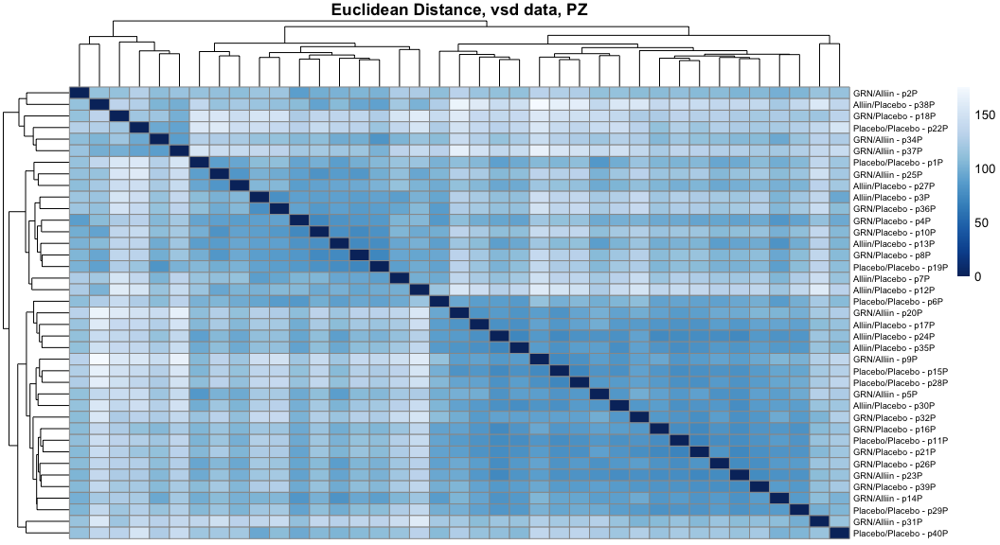<!-- -->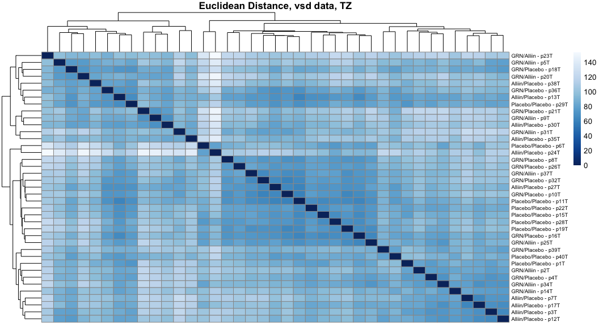<!-- -->

Heatmap of sample-to-sample distances using Poisson distance:

``` r
# Heatmap of sample-to-sample distances using Poisson distance
library("PoiClaClu")

for (T in c("PZ", "TZ")){
  
  if (T=="PZ"){
    dds <- dds.PZ
    plot.t <- "Peripheral Zone"
  }
  if (T=="TZ"){
    dds <- dds.TZ
    plot.t <- "Transitional Zone"
  }
    
  poisd <- PoissonDistance(t(counts(dds)))
  samplePoisDistMatrix <- as.matrix( poisd$dd )
  # add treatment name for the rows 
  library(stringr)
  hc.rownames <- dds$Group
  rownames(samplePoisDistMatrix) <- hc.rownames
  
  # do not include column names
  colnames(samplePoisDistMatrix) <- NULL
  pheatmap(samplePoisDistMatrix,
           clustering_distance_rows = poisd$dd,
           clustering_distance_cols = poisd$dd,
           col = colors,
           fontsize_row = 7,
           main = paste0("Poisson distances for ", plot.t))
  
  if (saveFiles){
    # do not include column names
    colnames(samplePoisDistMatrix) <- NULL
    pheatmap(samplePoisDistMatrix,
             clustering_distance_rows = poisd$dd,
             clustering_distance_cols = poisd$dd,
             col = colors,
             fontsize_row = 7,
             filename = paste(FIGLOC,"hc-poisson-", T, ".png", sep = ""),
             main = paste0("Poisson distances for ", plot.t))
  }
}
```

## Principal Component Analysis, PCA

In this section we plot the first two components of PCA using the VST
DATA.

### PCA for PZ samples

The samples are colour-coded by GRN and non-GRN interventions, and the
individual groups are represented by different shapes.

``` r
T="PZ"  
zoneTitle <- "Peripheral Zone"

vsd <- vsd.PZ
vsd$Intervention <- "GRN"
vsd$Intervention[vsd$TreatA == 0] <- "Non-GRN"
vsd$Intervention <- as.factor(vsd$Intervention)
vsd$Intervention <- relevel(vsd$Intervention, ref = "Non-GRN")

vsd$Group <- factor(vsd$Group, levels = c("Placebo/Placebo", "Alliin/Placebo", "GRN/Placebo", "GRN/Alliin"))

pcaData <- plotPCA(vsd, intgroup = c("TreatA","Group","Intervention"), returnData = TRUE ) 
percentVar <- round(100 * attr(pcaData, "percentVar"))
ggplot(pcaData, aes(x = PC1, y = PC2, color = Intervention, shape = Group)) +
  geom_point(size =3) +
  xlab(paste0("PC1: ", percentVar[1], "% variance")) +
  ylab(paste0("PC2: ", percentVar[2], "% variance")) +
  coord_fixed() +
  ggtitle(paste0("PCA plot using the VST data for GRN, ", zoneTitle))
```

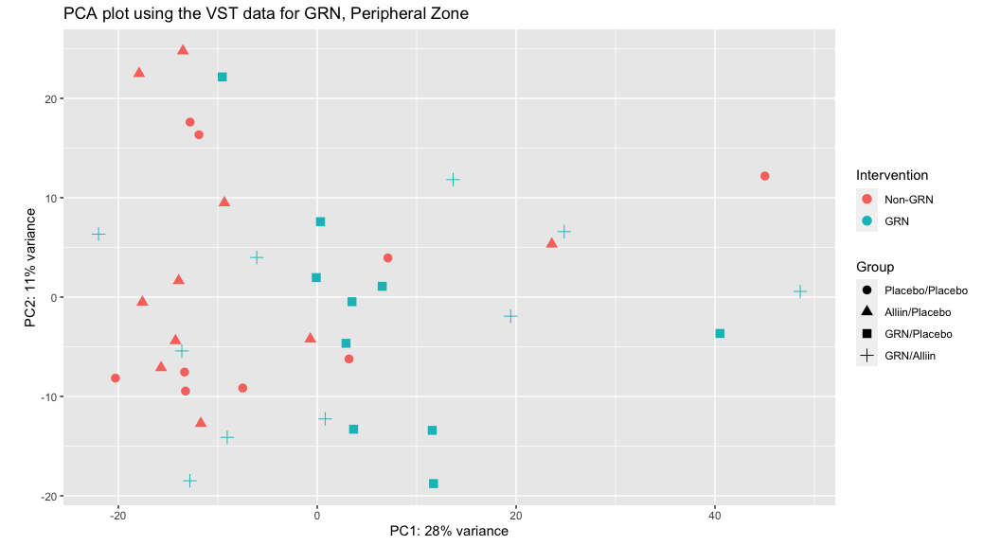<!-- -->

``` r
if (saveFiles){
  ggsave(paste0(FIGLOC,"PCA.GRN.PZ.pdf"))
}
```

    ## Saving 11 x 6 in image

### PCA for TZ samples

The samples are colour-coded by GRN and non-GRN interventions, and the
individual groups are represented by different shapes.

``` r
T="TZ"
zoneTitle <- "Transitional Zone"
vsd <- vsd.TZ
vsd$Intervention <- "GRN"
vsd$Intervention[vsd$TreatA == 0] <- "Non-GRN"
vsd$Intervention <- as.factor(vsd$Intervention)
vsd$Intervention <- relevel(vsd$Intervention, ref = "Non-GRN")

vsd$Group <- factor(vsd$Group, levels = c("Placebo/Placebo", "Alliin/Placebo", "GRN/Placebo", "GRN/Alliin"))

pcaData <- plotPCA(vsd, intgroup = c("TreatA","Intervention", "Group"), returnData = TRUE ) 
percentVar <- round(100 * attr(pcaData, "percentVar"))
ggplot(pcaData, aes(x = PC1, y = PC2, color = Intervention, shape = Group)) +
  geom_point(size =3) +
  xlab(paste0("PC1: ", percentVar[1], "% variance")) +
  ylab(paste0("PC2: ", percentVar[2], "% variance")) +
  coord_fixed() +
  ggtitle(paste0("PCA plot using the VST data for GRN, ", zoneTitle))
```

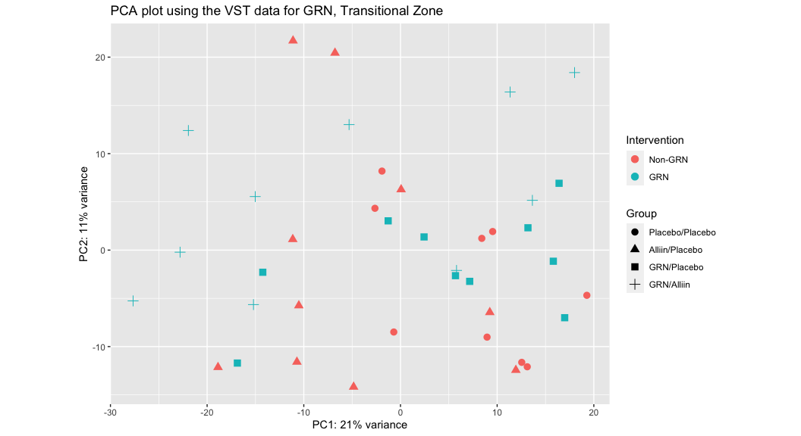<!-- -->

``` r
if (saveFiles){
  ggsave(paste0(FIGLOC, "PCA.GRN.TZ.pdf"))
}
```

    ## Saving 11 x 6 in image

### PCA for Control samples: Peripheral vs Transitional Zones

We perform PCA to explore the transcriptomic profiles of the two zones,
using only control samples (Placebo/Placebo group).

``` r
# using ggplot2 to plot PCA, with no sample names
vsdT <- vsd.PP
vsdT$ZoneCode <- as.factor(vsdT$ZoneCode)

pcaData <- plotPCA(vsdT, intgroup = c("ZoneCode"), returnData = TRUE ) 
percentVar <- round(100 * attr(pcaData, "percentVar"))
ggplot(pcaData, aes(x = PC1, y = PC2, color = ZoneCode, shape = ZoneCode)) +
  geom_point(size =3) +
  xlab(paste0("PC1: ", percentVar[1], "% variance")) +
  ylab(paste0("PC2: ", percentVar[2], "% variance")) +
  coord_fixed() +
  ggtitle("PCA plot using the VST data for Control Samples: PZ and TZ")
```

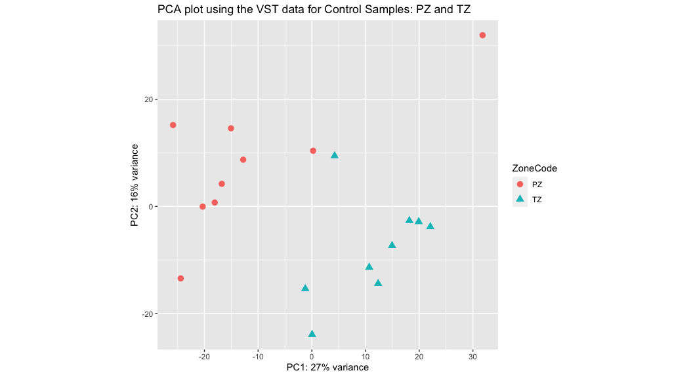<!-- -->

## Part 2: Differential Expression Analysis

Differntial expression analysis is done with DESeq2 on each zone
separately to test for the main effect of the treatments: Glucoraphanin
(TreatA) and Alliin (TreatB). We use the following design:

design = \~TreatA + TreatB

After testing the effect of each treatment, we will test if there are
any significant interactions using the design:

design = \~TreatA + TreatB + TreatA:TreatB

Furthermore, shrinkage of effect size (LFC estimates) is useful for
visualising and ranking of genes. Here we use the apeglm method for
shrinking coefficients as it is good for shrinking the noisy log FC
estimates while giving low bias LFC estimated for true differences
\[Zhum, Ibrahim and Love, 2018\]

NOTE: DESeq2 includes a function that automatically replace counts with
large Cook’s distance with the trimmed mean over all samples, scaled up
by the size factor for that sample. Using “minReplicatesForReplace =
Inf”, this replacement function is switched off.

### Main effect of the two treatments (design = \~TreatA + TreatB)

``` r
##  Differential Expression for samples in the Peripheral Zone  ##
dds.PZ <- DESeq(dds.PZ, minReplicatesForReplace = Inf)
```

    ## estimating size factors

    ## estimating dispersions

    ## gene-wise dispersion estimates

    ## mean-dispersion relationship

    ## final dispersion estimates

    ## fitting model and testing

``` r
##    ---- Building results table for BC,BD  vs  AD,AC ----
res.BC.PZ <- results(dds.PZ, contrast = c("TreatA", "1", "0"))
summary(res.BC.PZ)
```

    ## 
    ## out of 25300 with nonzero total read count
    ## adjusted p-value < 0.1
    ## LFC > 0 (up)       : 4, 0.016%
    ## LFC < 0 (down)     : 0, 0%
    ## outliers [1]       : 164, 0.65%
    ## low counts [2]     : 0, 0%
    ## (mean count < 9)
    ## [1] see 'cooksCutoff' argument of ?results
    ## [2] see 'independentFiltering' argument of ?results

``` r
res.BC.PZ.shrink <- lfcShrink(dds.PZ, coef="TreatA_1_vs_0", type="apeglm", res = res.BC.PZ)
```

    ## using 'apeglm' for LFC shrinkage. If used in published research, please cite:
    ##     Zhu, A., Ibrahim, J.G., Love, M.I. (2018) Heavy-tailed prior distributions for
    ##     sequence count data: removing the noise and preserving large differences.
    ##     Bioinformatics. https://doi.org/10.1093/bioinformatics/bty895

``` r
summary(res.BC.PZ.shrink)
```

    ## 
    ## out of 25300 with nonzero total read count
    ## adjusted p-value < 0.1
    ## LFC > 0 (up)       : 4, 0.016%
    ## LFC < 0 (down)     : 0, 0%
    ## outliers [1]       : 164, 0.65%
    ## low counts [2]     : 0, 0%
    ## (mean count < 9)
    ## [1] see 'cooksCutoff' argument of ?results
    ## [2] see 'independentFiltering' argument of ?results

``` r
##   ---- Building results table for AD,BD  vs  BC,AC" ----
res.AD.PZ <- results(dds.PZ, contrast = c("TreatB", "1", "0"))
summary(res.AD.PZ)
```

    ## 
    ## out of 25300 with nonzero total read count
    ## adjusted p-value < 0.1
    ## LFC > 0 (up)       : 0, 0%
    ## LFC < 0 (down)     : 1, 0.004%
    ## outliers [1]       : 164, 0.65%
    ## low counts [2]     : 0, 0%
    ## (mean count < 9)
    ## [1] see 'cooksCutoff' argument of ?results
    ## [2] see 'independentFiltering' argument of ?results

``` r
res.AD.PZ.shrink <- lfcShrink(dds.PZ, coef="TreatB_1_vs_0", type="apeglm", res = res.AD.PZ)
```

    ## using 'apeglm' for LFC shrinkage. If used in published research, please cite:
    ##     Zhu, A., Ibrahim, J.G., Love, M.I. (2018) Heavy-tailed prior distributions for
    ##     sequence count data: removing the noise and preserving large differences.
    ##     Bioinformatics. https://doi.org/10.1093/bioinformatics/bty895

``` r
summary(res.AD.PZ.shrink)
```

    ## 
    ## out of 25300 with nonzero total read count
    ## adjusted p-value < 0.1
    ## LFC > 0 (up)       : 0, 0%
    ## LFC < 0 (down)     : 1, 0.004%
    ## outliers [1]       : 164, 0.65%
    ## low counts [2]     : 0, 0%
    ## (mean count < 9)
    ## [1] see 'cooksCutoff' argument of ?results
    ## [2] see 'independentFiltering' argument of ?results

``` r
##  Differential Expression for samples in the Transitional Zone ##
dds.TZ <- DESeq(dds.TZ, minReplicatesForReplace = Inf)
```

    ## estimating size factors

    ## estimating dispersions

    ## gene-wise dispersion estimates

    ## mean-dispersion relationship

    ## final dispersion estimates

    ## fitting model and testing

``` r
#  ---- Building results table for BC,BD  vs  AD,AC" ----
res.BC.TZ <- results(dds.TZ, contrast = c("TreatA", "1", "0"))
summary(res.BC.TZ)
```

    ## 
    ## out of 25632 with nonzero total read count
    ## adjusted p-value < 0.1
    ## LFC > 0 (up)       : 2, 0.0078%
    ## LFC < 0 (down)     : 2, 0.0078%
    ## outliers [1]       : 60, 0.23%
    ## low counts [2]     : 0, 0%
    ## (mean count < 8)
    ## [1] see 'cooksCutoff' argument of ?results
    ## [2] see 'independentFiltering' argument of ?results

``` r
res.BC.TZ.shrink <- lfcShrink(dds.TZ, coef="TreatA_1_vs_0", type="apeglm", res = res.BC.TZ)
```

    ## using 'apeglm' for LFC shrinkage. If used in published research, please cite:
    ##     Zhu, A., Ibrahim, J.G., Love, M.I. (2018) Heavy-tailed prior distributions for
    ##     sequence count data: removing the noise and preserving large differences.
    ##     Bioinformatics. https://doi.org/10.1093/bioinformatics/bty895

``` r
summary(res.BC.TZ.shrink)
```

    ## 
    ## out of 25632 with nonzero total read count
    ## adjusted p-value < 0.1
    ## LFC > 0 (up)       : 2, 0.0078%
    ## LFC < 0 (down)     : 2, 0.0078%
    ## outliers [1]       : 60, 0.23%
    ## low counts [2]     : 0, 0%
    ## (mean count < 8)
    ## [1] see 'cooksCutoff' argument of ?results
    ## [2] see 'independentFiltering' argument of ?results

``` r
##   ---- Building results table for AD,BD  vs  BC,AC" ----
res.AD.TZ <- results(dds.TZ, contrast = c("TreatB", "1", "0"))
summary(res.AD.TZ)
```

    ## 
    ## out of 25632 with nonzero total read count
    ## adjusted p-value < 0.1
    ## LFC > 0 (up)       : 88, 0.34%
    ## LFC < 0 (down)     : 57, 0.22%
    ## outliers [1]       : 60, 0.23%
    ## low counts [2]     : 3976, 16%
    ## (mean count < 24)
    ## [1] see 'cooksCutoff' argument of ?results
    ## [2] see 'independentFiltering' argument of ?results

``` r
res.AD.TZ.shrink <- lfcShrink(dds.TZ, coef="TreatB_1_vs_0", type="apeglm", res = res.AD.TZ)
```

    ## using 'apeglm' for LFC shrinkage. If used in published research, please cite:
    ##     Zhu, A., Ibrahim, J.G., Love, M.I. (2018) Heavy-tailed prior distributions for
    ##     sequence count data: removing the noise and preserving large differences.
    ##     Bioinformatics. https://doi.org/10.1093/bioinformatics/bty895

``` r
summary(res.AD.TZ.shrink)
```

    ## 
    ## out of 25632 with nonzero total read count
    ## adjusted p-value < 0.1
    ## LFC > 0 (up)       : 88, 0.34%
    ## LFC < 0 (down)     : 57, 0.22%
    ## outliers [1]       : 60, 0.23%
    ## low counts [2]     : 3976, 16%
    ## (mean count < 24)
    ## [1] see 'cooksCutoff' argument of ?results
    ## [2] see 'independentFiltering' argument of ?results

### Test for any significant interactions (design = \~TreatA + TreatB + TreatA:TreatB)

``` r
# Peripheral Zone
# Testing Model 2 (interaction) for the Peripheral Zone
dds.M2.PZ <- DESeq(dds.M2.PZ, test = "LRT", reduced = ~TreatA + TreatB)
```

    ## estimating size factors

    ## estimating dispersions

    ## gene-wise dispersion estimates

    ## mean-dispersion relationship

    ## final dispersion estimates

    ## fitting model and testing

    ## -- replacing outliers and refitting for 127 genes
    ## -- DESeq argument 'minReplicatesForReplace' = 7 
    ## -- original counts are preserved in counts(dds)

    ## estimating dispersions

    ## fitting model and testing

``` r
# Coefficients in the fitted model:
resultsNames(dds.M2.PZ)
```

    ## [1] "Intercept"       "TreatA_1_vs_0"   "TreatB_1_vs_0"   "TreatA1.TreatB1"

``` r
# The coefficientes for the interaction (stored as the last coefficient)
# These are the results for the interaction coefficient:
res.M2.PZ.interaction <- results(dds.M2.PZ)
summary(res.M2.PZ.interaction)
```

    ## 
    ## out of 25300 with nonzero total read count
    ## adjusted p-value < 0.1
    ## LFC > 0 (up)       : 1, 0.004%
    ## LFC < 0 (down)     : 1, 0.004%
    ## outliers [1]       : 0, 0%
    ## low counts [2]     : 0, 0%
    ## (mean count < 9)
    ## [1] see 'cooksCutoff' argument of ?results
    ## [2] see 'independentFiltering' argument of ?results

``` r
# Transitional Zone
# Testing Model 2 (interaction) for the Transitional Zone
dds.M2.TZ <- DESeq(dds.M2.TZ, test = "LRT", reduced = ~TreatA + TreatB)
```

    ## estimating size factors

    ## estimating dispersions

    ## gene-wise dispersion estimates

    ## mean-dispersion relationship

    ## final dispersion estimates

    ## fitting model and testing

    ## -- replacing outliers and refitting for 46 genes
    ## -- DESeq argument 'minReplicatesForReplace' = 7 
    ## -- original counts are preserved in counts(dds)

    ## estimating dispersions

    ## fitting model and testing

``` r
# Coefficients in the fitted model
resultsNames(dds.M2.TZ)
```

    ## [1] "Intercept"       "TreatA_1_vs_0"   "TreatB_1_vs_0"   "TreatA1.TreatB1"

``` r
# The coefficientes for the interaction (stored as the last coefficient)
# These are the results for the interaction coefficient:
res.M2.TZ.interaction <- results(dds.M2.TZ)
summary(res.M2.TZ.interaction)
```

    ## 
    ## out of 25632 with nonzero total read count
    ## adjusted p-value < 0.1
    ## LFC > 0 (up)       : 0, 0%
    ## LFC < 0 (down)     : 0, 0%
    ## outliers [1]       : 0, 0%
    ## low counts [2]     : 0, 0%
    ## (mean count < 8)
    ## [1] see 'cooksCutoff' argument of ?results
    ## [2] see 'independentFiltering' argument of ?results

### Diagnostic Plots

#### Histogram of p-values

Histogram of p-values for the main effect of the treatments in the
prostate zones.

``` r
res <- res.BC.PZ
hist(res$pvalue[res$baseMean > 1], breaks = 0:100/100,
     col = "grey50", border = "white",
     xlab = "p-value",
     main = "p-values for the effect of GRN on the Peripheral Zone")
```

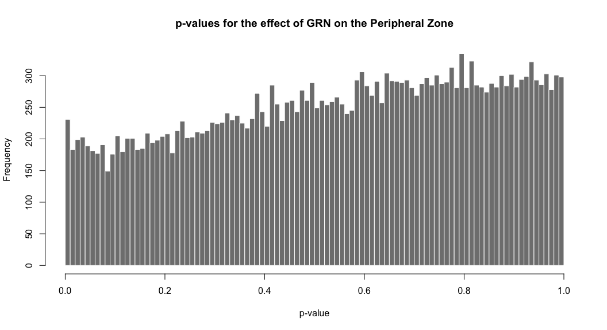<!-- -->

``` r
res <- res.AD.PZ
hist(res$pvalue[res$baseMean > 1], breaks = 0:100/100,
     col = "grey50", border = "white",
     xlab = "p-value",
     main = "p-values for the effect of Alliin on the Peripheral Zone")
```

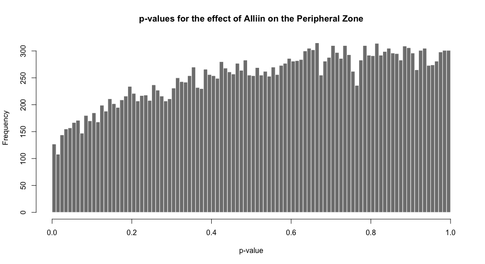<!-- -->

``` r
res <- res.BC.TZ
hist(res$pvalue[res$baseMean > 1], breaks = 0:100/100,
     col = "grey50", border = "white",
     xlab = "p-value",
     main = "p-values for the effect of GRN on the Transitional Zone")
```

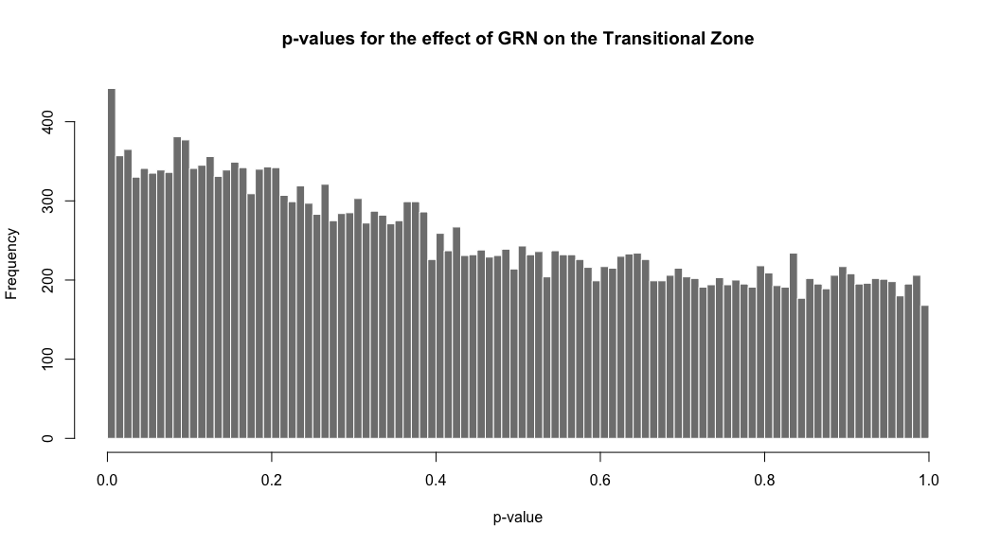<!-- -->

``` r
res <- res.AD.TZ
hist(res$pvalue[res$baseMean > 1], breaks = 0:100/100,
     col = "grey50", border = "white",
     xlab = "p-value",
     main = "p-values for the effect of Alliin on the Transitional Zone")
```

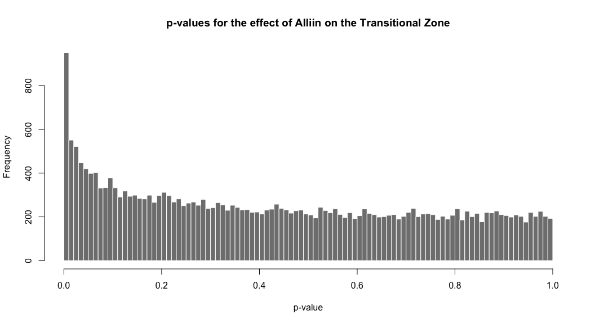<!-- -->

Histogram of p-values for the interaction of the treatments in the
prostate zones.

``` r
res <- res.M2.PZ.interaction

hist(res$pvalue[res$baseMean > 1], breaks = 0:100/100,
     col = "grey50", border = "white", 
     main = "Effect from the interaction GRN + Alliin, Peripheral Zone")
```

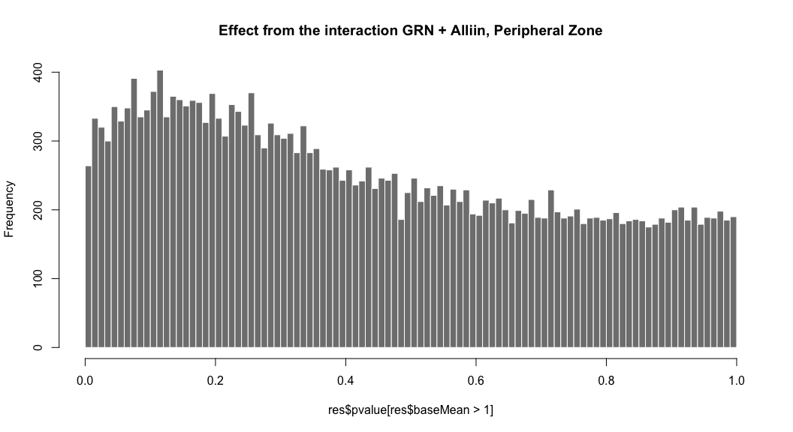<!-- -->

``` r
res <- res.M2.TZ.interaction

hist(res$pvalue[res$baseMean > 1], breaks = 0:100/100,
     col = "grey50", border = "white",
     main = "Effect from the interaction GRN + Alliin, Transitional Zone")
```

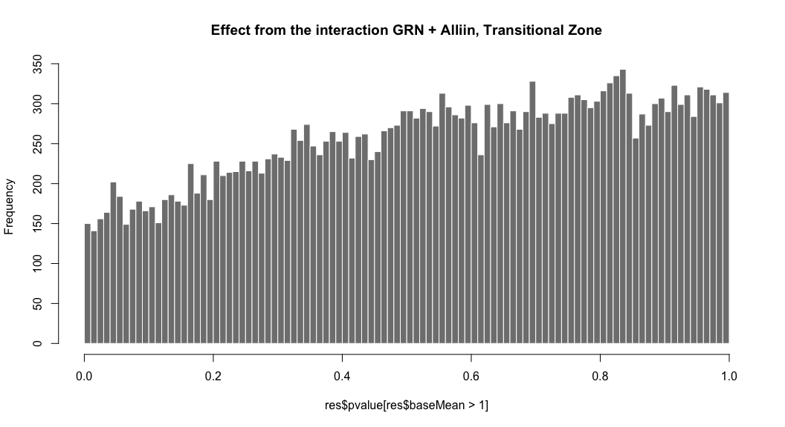<!-- -->

#### Estimating Size Factors

``` r
sizeFactors(dds.PZ)
```

    ##       p1P       p2P       p3P       p4P       p5P       p6P       p7P       p8P 
    ## 0.8868821 1.0404268 0.8239543 0.8729996 1.1847533 1.0747757 0.8309334 0.9738548 
    ##       p9P      p10P      p11P      p12P      p13P      p14P      p15P      p16P 
    ## 1.1085744 0.7981409 1.0268568 0.8350167 0.8449961 1.0947087 1.1010437 1.2235336 
    ##      p17P      p18P      p19P      p20P      p21P      p22P      p23P      p24P 
    ## 1.1304446 1.0724257 1.0404413 1.1135388 1.2302915 1.0491284 1.1655528 1.1363073 
    ##      p25P      p26P      p27P      p28P      p29P      p30P      p31P      p32P 
    ## 0.9439420 0.9418998 0.8911124 1.1992082 1.1037485 1.0599595 1.0542546 1.1669024 
    ##      p34P      p35P      p36P      p37P      p38P      p39P      p40P 
    ## 1.1289770 0.8980794 0.8074167 0.9131472 0.9925328 1.1048711 0.9062146

``` r
colSums(counts(dds.PZ))
```

    ##      p1P      p2P      p3P      p4P      p5P      p6P      p7P      p8P 
    ## 35255226 39022301 27172213 31323772 48718227 41973872 29195408 33145511 
    ##      p9P     p10P     p11P     p12P     p13P     p14P     p15P     p16P 
    ## 53637933 26168831 44836773 28362951 30832964 41845863 52080322 48187605 
    ##     p17P     p18P     p19P     p20P     p21P     p22P     p23P     p24P 
    ## 48065465 39881056 36025439 49835501 50799586 38553926 46922078 46255968 
    ##     p25P     p26P     p27P     p28P     p29P     p30P     p31P     p32P 
    ## 32459385 38413112 34736129 53813775 43910845 48105489 44344979 50784929 
    ##     p34P     p35P     p36P     p37P     p38P     p39P     p40P 
    ## 40716653 35979132 27328223 31310545 29918783 45786575 32862420

``` r
sizeFactors(dds.TZ)
```

    ##       p1T       p2T       p3T       p4T       p5T       p6T       p7T       p8T 
    ## 1.0709949 0.9972566 0.9787229 1.0072546 0.8438744 0.9618429 0.8451961 1.1962344 
    ##       p9T      p10T      p11T      p12T      p13T      p14T      p15T      p16T 
    ## 1.0119594 1.0523950 1.1572383 0.8598212 1.1045229 0.8260544 1.1401240 1.1383097 
    ##      p17T      p18T      p19T      p20T      p21T      p22T      p23T      p24T 
    ## 0.9887855 0.8942547 0.9698839 1.0568681 0.9951146 0.9429123 1.0156630 1.0523244 
    ##      p25T      p26T      p27T      p28T      p29T      p30T      p31T      p32T 
    ## 1.0644418 1.2157436 1.0106966 1.1502283 1.0923365 1.1242444 1.0306016 0.9761827 
    ##      p34T      p35T      p36T      p37T      p38T      p39T      p40T 
    ## 1.0334284 1.1605028 1.1204831 0.9660816 0.8457371 0.8807948 0.8987464

``` r
colSums(counts(dds.TZ))
```

    ##      p1T      p2T      p3T      p4T      p5T      p6T      p7T      p8T 
    ## 38313914 33936661 32320777 33735981 32043449 34528591 28660959 44468881 
    ##      p9T     p10T     p11T     p12T     p13T     p14T     p15T     p16T 
    ## 44805886 39467367 42428682 29347871 40868911 29095848 41636901 39093045 
    ##     p17T     p18T     p19T     p20T     p21T     p22T     p23T     p24T 
    ## 32604874 33381416 34737814 42675281 42181539 33326123 41012402 32579845 
    ##     p25T     p26T     p27T     p28T     p29T     p30T     p31T     p32T 
    ## 37036480 44029693 37894007 40260081 41002204 47892264 42087133 37345260 
    ##     p34T     p35T     p36T     p37T     p38T     p39T     p40T 
    ## 34443588 46119948 42043606 35815455 32837351 32378628 34396825

``` r
# Size Factors for PZ
par(mfrow=c(1,2))
for (Z in c("PZ", "TZ")){
  if (Z == "PZ"){
    dds <- dds.PZ
    tplot <- "Peripheral"
  }else{
    dds <- dds.TZ
    tplot <- "Transitional"
  }
  
  sizeFactors(dds)
  colSums(counts(dds))
  
  plot(sizeFactors(dds), colSums(counts(dds)))
  title(main = tplot)
  abline(lm(colSums(counts(dds)) ~ sizeFactors(dds) + 0))  
  
}
```

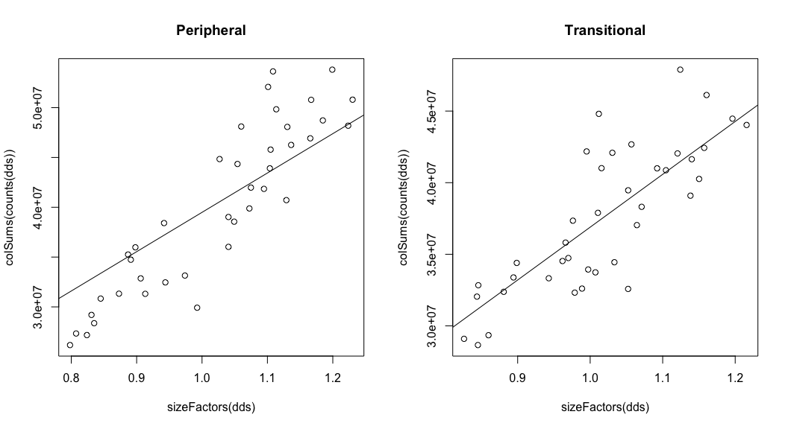<!-- -->

#### Mean-Variance relationship

Another useful diagnostic plot is to visualise the mean-variance
relationship. The plot below shows the variance in gene expression
increases with mean expression, where each black dot is a gene.

``` r
## PZ
Z = "PZ"
dds <- dds.PZ

# Calculating mean for each gene
mean.Counts <- apply(assay(dds), 1, mean)

# Calculating variance for each gene
var.Counts <- apply(assay(dds), 1, var)


# Plot the mean versus variance in read count data
df <- data.frame(mean.Counts, var.Counts)

ggplot(df) +
  geom_point(aes(x=mean.Counts, y= var.Counts)) +
  scale_y_log10() +
  scale_x_log10() +
  xlab("Mean counts per gene") +
  ylab("Variance per gene") +
  labs(title = paste0("DESeq2 model - Dispersion: ", Z))
```

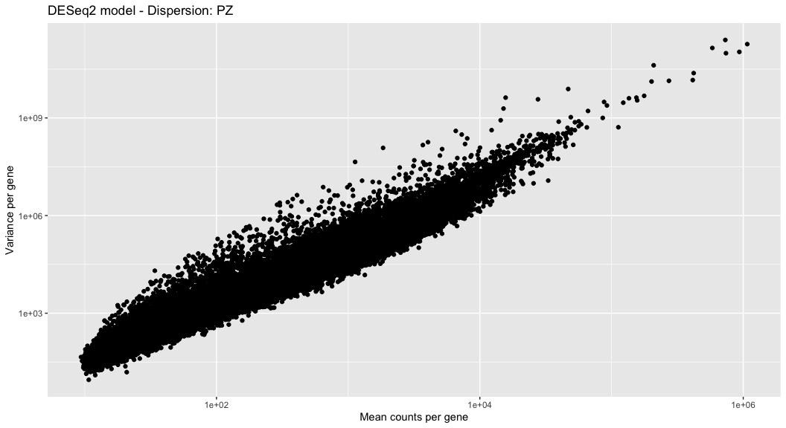<!-- -->

``` r
## TZ
Z = "TZ"
dds <- dds.TZ

# Calculating mean for each gene
mean.Counts <- apply(assay(dds), 1, mean)

# Calculating variance for each gene
var.Counts <- apply(assay(dds), 1, var)


# Plot the mean versus variance in read count data
df <- data.frame(mean.Counts, var.Counts)

ggplot(df) +
  geom_point(aes(x=mean.Counts, y= var.Counts)) +
  scale_y_log10() +
  scale_x_log10() +
  xlab("Mean counts per gene") +
  ylab("Variance per gene") +
  labs(title = paste0("DESeq2 model - Dispersion: ", Z))
```

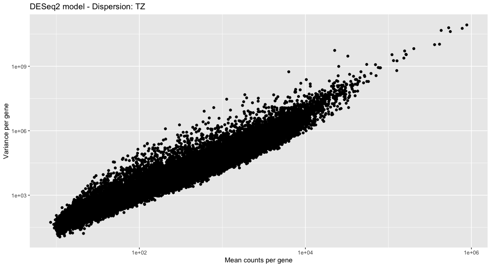<!-- -->

#### MA Plot

The MA plot shows the fold change over the average expression level of
all samples.

``` r
par(mfrow=c(2,2))
for (T in c("BC.PZ", "AD.PZ", "BC.TZ", "AD.TZ")){
  if (T == "BC.PZ"){  
    res <- res.BC.PZ
    tplot <- "MA-plot: Glucoraphanin, PZ"
  }
  if (T == "AD.PZ"){
    res <- res.AD.PZ
    tplot <- "MA-plot: Alliin, PZ"
  }
  if (T == "BC.TZ"){
    res <- res.BC.TZ
    tplot <- "MA-plot: Glucoraphanin, TZ"
  }
  if (T == "AD.TZ"){
    res <- res.AD.TZ
    tplot <- "MA-plot: Alliin, TZ"
  }
  
  plotMA(res, ylim=c(-5,5), main = tplot)
  
}
```

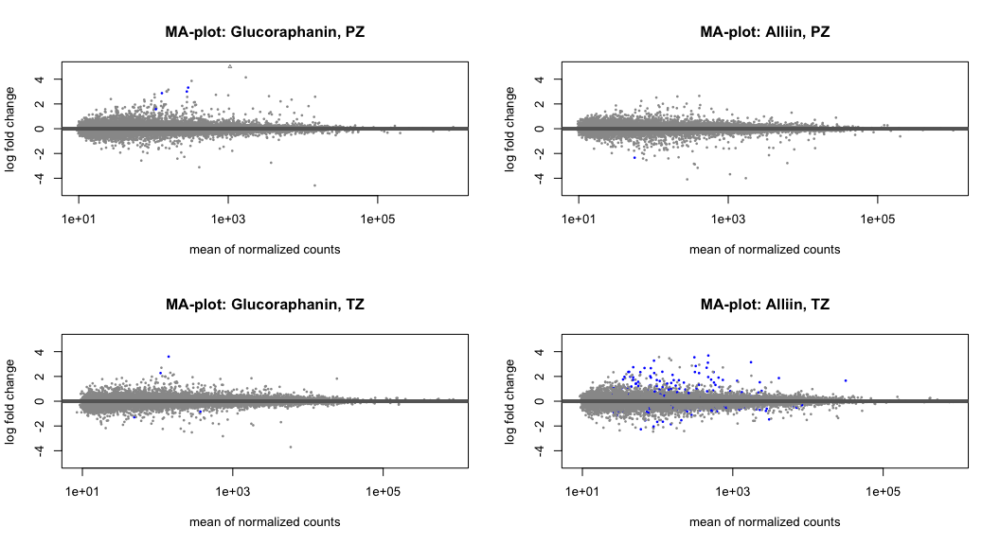<!-- -->

#### Dispersion

Plotting the dispersion estimates is a useful diagnostic for the model.
The plot shows the gene-wise estimates towards the fitted estimates.

``` r
for (Z in c("PZ", "TZ")){
  if (Z == "PZ"){
    dds <- dds.PZ
  }else{
    dds <- dds.TZ
  }
  
  
  plotDispEsts(dds, main = Z)
}
```

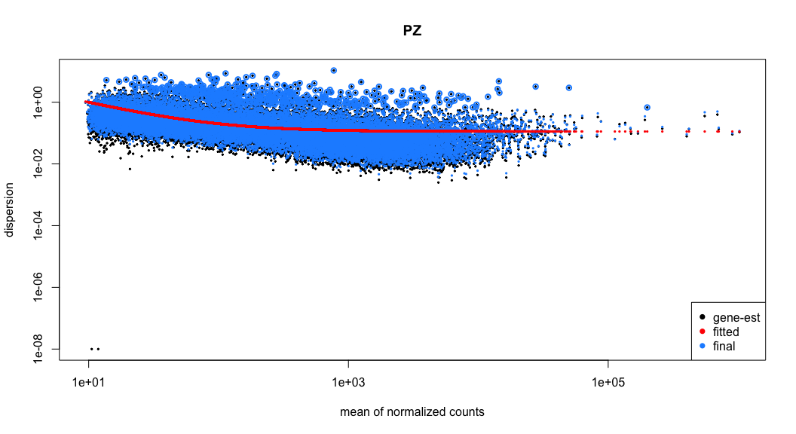<!-- -->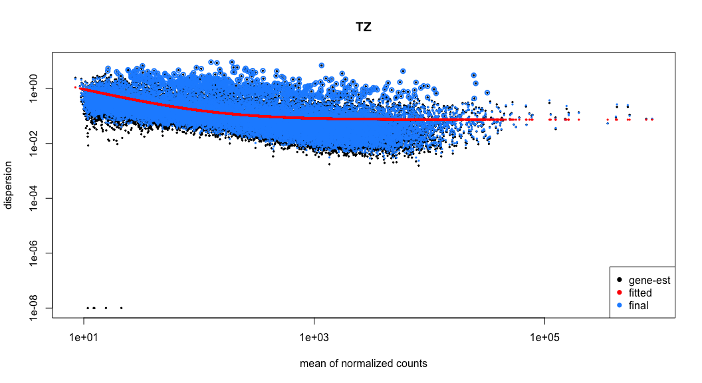<!-- -->

### Multiple Testing

Using Benjamini-Hochberg (BH) adjustment.

This method calculates for each gene an adjusted pvalue that answers the
question: if one called significant all genes with an adjusted p value
less than or equal to this gene’s adjusted p value threshold, what would
be the fraction of false positives (the false discovery rate, FDR) among
them? These values, called the BH-adjusted p values, are given in the
column q.value in the following tables.

For multiple testin, if we consider a fraction of 10% false positives
acceptable, we can consider all genes with an adjusted p value below
10%=0.1 as significant.

| Treatment | Prostate.Zone | Pass.Wald.Test | p.value.0.1 | p.value.0.05 | q.value.0.1 | q.value.0.05 |
|:----------|:--------------|---------------:|------------:|-------------:|------------:|-------------:|
| GRN       | PZ            |          25136 |        1879 |         1005 |           4 |            3 |
| Alliin    | PZ            |          25136 |        1526 |          691 |           1 |            1 |
| GRN       | TZ            |          25572 |        3603 |         1835 |           4 |            2 |
| Alliin    | TZ            |          25572 |        4736 |         2891 |         145 |           42 |

    ## [1] "Table saved to file: ../results/DE-DESeq2/DE-multiple-testing.txt"

| Treatment | Prostate.Zone | q.value.0.5 | q.value.0.2 | q.value.0.1 | q.value.0.05 | q.value.0.01 |
|:----------|:--------------|------------:|------------:|------------:|-------------:|-------------:|
| GRN       | PZ            |          21 |          13 |           4 |            3 |            2 |
| Alliin    | PZ            |           4 |           3 |           1 |            1 |            0 |
| GRN       | TZ            |         302 |          30 |           4 |            2 |            1 |
| Alliin    | TZ            |        4061 |         563 |         145 |           42 |           10 |

    ## [1] "Table saved to file: ../results/DE-DESeq2/DE-multiple-testing.qval.txt"

| Treatment | p.val.0.1.up | p.val.0.1.down | p.val.0.05.up | p.val.0.05.down | q.val.0.1.up | q.val.0.1.down | q.val.0.05.up | q.val.0.05.down |
|:----------|-------------:|---------------:|--------------:|----------------:|-------------:|---------------:|--------------:|----------------:|
| GRN.PZ    |         1083 |            796 |           608 |             397 |            4 |              0 |             3 |               0 |
| Alliin.PZ |          961 |            565 |           422 |             269 |            0 |              1 |             0 |               1 |
| GRN.TZ    |         1846 |           1757 |           884 |             951 |            2 |              2 |             1 |               1 |
| Alliin.TZ |         2420 |           2316 |          1395 |            1496 |           88 |             57 |            37 |               5 |

    ## [1] "Table saved to file: ../results/DE-DESeq2/DE-multiple-testing-up-down.txt"

### Annotating Genes

In this section, genes are annotated with ensembl IDs, HGNC symbol names
and entrez names and descriptions. The annotated genes are saved to
file, with the following file name format (if saveFiles variable is set
to true):

``` results/de-deseq2/\<zone\>\_de\_\<treatment\>_all-genes_annotation_prefiltering.txt```

In addition, genes are ranked for GSEA using the following score:

```sign-log2FC * log10 (p-value)```

and save to file following the file name format:


```results/DE-DESeq2/\<ZONE\>\_\<TREATMENT\>_ranked-genes_ensembl.rnk ```


```r
# Annotation with biomaRt's useEnsembl function
ensembl = useEnsembl(biomart="ensembl", dataset="hsapiens_gene_ensembl")

# Adding annotation to the results of each of the four tests: GRN and Alliin in both PZ and TZ
for (T in c("BC.PZ", "AD.PZ", "BC.TZ", "AD.TZ")){

    # GRN.PZ
    if (T == "BC.PZ"){
      tr <- "GRN"
      zone <- "PZ"
      res <- res.BC.PZ
    }
  
    # Alliin.PZ
    if (T == "AD.PZ"){
      tr <- "Alliin"
      zone <- "PZ"
      res <- res.AD.PZ
    }
    
    # GRN.TZ
    if (T == "BC.TZ"){
      tr <- "GRN"
      zone <- "TZ"
      res <- res.BC.TZ
    }
  
    # Alliin.TZ  
    if (T == "AD.TZ"){
      tr <- "Alliin"
      zone <- "TZ"
      res <- res.AD.TZ
    }
  
    
    print(paste0("Processing: ", tr, ", zone: ", zone))
    qvalue <- 0.1

    # Gene symbols
    res$ensemblID <- rownames(res)
    
    # list of attributes to retrieve
    ensembl.attributes <- listAttributes(ensembl)
    annot <- getBM(attributes=c('ensembl_gene_id','description', 'entrezgene_description',
                                 'hgnc_symbol','external_gene_name','gene_biotype'),
                    filters = 'ensembl_gene_id', 
                    values = res$ensemblID, 
                    mart = ensembl)
    
    # find the annotation for each gene
    hngc.symbol <- integer(length(res$ensemblID))
    entrez.desc <- integer(length(res$ensemblID))
    name <- integer(length(res$ensemblID))
    type <- integer(length(res$ensemblID))
    description <- integer(length(res$ensemblID))
    for (ii in c(1:length(res$ensemblID))){
      g.ensembl <- res$ensemblID[ii]
      
      indx <- which(annot$ensembl_gene_id == g.ensembl)
      if (length(indx)==1){
        hngc.symbol[ii] <- annot$hgnc_symbol[indx]
        entrez.desc[ii] <- annot$entrezgene_description[indx]
        name[ii] <- annot$external_gene_name[indx]
        type[ii] <- annot$gene_biotype[indx]
        description[ii] <- annot$description[indx]
        
        } else if (length(indx)>0) { # if there is more than one symbol, use the first match
          hngc.symbol[ii] <- annot$hgnc_symbol[indx[1]]
          entrez.desc[ii] <- annot$entrezgene_description[indx[1]]
          name[ii] <- annot$external_gene_name[indx[1]]
          type[ii] <- annot$gene_biotype[indx[1]]
          description[ii] <- annot$description[indx[1]]
        } else {    # if there is no annotation, for example is a gene was retired from ensembl, add NA
          hngc.symbol[ii] <- "NA"
          entrez.desc[ii] <- "NA"
          name[ii] <- "NA"
          type[ii] <- "NA"
          description[ii] <- "NA"
        }
    }
    
    # If hngc.symbol is empty, add "NA"
    hngc.symbol[which(hngc.symbol == "")] = "NA"
    entrez.desc[which(entrez.desc == "")] = "NA"
  
    res$hngc.symbol <- hngc.symbol  
    res$description <- description
    res$entrez.desc <- entrez.desc
    res$name <- name
    res$biotype <- type
    
    ## Update RES object with the annotation
    
    if (T == "BC.PZ"){
      res.BC.PZ <- res
    }
    
    if (T == "AD.PZ"){
      res.AD.PZ <- res
    }
    
    if (T == "BC.TZ"){
      res.BC.TZ <- res
    }
    
    if (T == "AD.TZ"){
      res.AD.TZ <- res
    }
    
    
    ## Save the results to file, keep all genes, even those with p.value = NA
    resOrdered <- res[order(res$padj),]
    head(resOrdered)
    
    
    # Save the results for all genes
    resAll <- as.data.frame(resOrdered)
    TResAll <- data.frame(ensemblID = resAll$ensemblID,
                          HGNC.symbol = resAll$hngc.symbol,
                          baseMean = resAll$baseMean,
                          log2FoldChange = resAll$log2FoldChange,
                          lfcSE = resAll$lfcSE,
                          pvalue = resAll$pvalue,
                          padj = resAll$padj,
                          description = resAll$description,
                          entrez.description = resAll$entrez.desc,
                          gene.name = resAll$name,
                          gene.biotype = resAll$biotype)
    
    if (saveFiles){
      res.all.File <- paste0(DELOC,
                           zone,"_DE_",tr,"_all-genes_annotation_", threshold, ".txt")
      print(paste0("Saving results to file: ", res.all.File, "..."))
      write.table(TResAll, file = res.all.File, quote = FALSE, row.names = FALSE, sep = "\t")
      print("done!")
    }
    
    #### Rank Genes for GSEA ####
    print("Ranking genes for GSEA")
    # Get subset of genes with no p.value (NA)
    indx <- !is.na(TResAll$pvalue)
    subset <- TResAll[indx,]
   
    sprintf("Reading gene IDs ...")
    ensemblID <- as.character(subset$ensemblID)
    head(ensemblID)
    
    # p-values
    pval <- subset$pvalue
    # log2 Fold Change
    fc <- as.numeric(subset$log2FoldChange)
  
    # calculate log 10 of p-values
    log10.pvalues <- log10(pval)
    
    # The score takes the sign of the logFC
    # indexes to all negative logFC
    indx2 <- fc<0
  
    # list of ranked genes
    #  score = sign FC * (- log10pvalue)
    #  sort score : descending order
    score <- -log10.pvalues
    score[indx2==TRUE] <- -score[indx2==TRUE]
    r <- data.frame( ensemblID = ensemblID, score = score)
    rsorted <- r[order(-r$score),]
    
    if (saveFiles){
      rnkFile <- paste0(DELOC,
                        zone,"_",tr,"_ranked-genes_ensembl.rnk")
      # Save ranked genes to file:
      write.table(rsorted, file = rnkFile, row.names = FALSE, col.names = FALSE, sep = "\t", quote = TRUE)
      print(paste0("Ranked list saved to file: ", rnkFile))
      print("Done!!")
  
    }
    
    
}
```

    ## [1] "Processing: GRN, zone: PZ"
    ## [1] "Saving results to file: ../results/DE-DESeq2/PZ_DE_GRN_all-genes_annotation_prefiltering.txt..."
    ## [1] "done!"
    ## [1] "Ranking genes for GSEA"
    ## [1] "Ranked list saved to file: ../results/DE-DESeq2/PZ_GRN_ranked-genes_ensembl.rnk"
    ## [1] "Done!!"
    ## [1] "Processing: Alliin, zone: PZ"
    ## [1] "Saving results to file: ../results/DE-DESeq2/PZ_DE_Alliin_all-genes_annotation_prefiltering.txt..."
    ## [1] "done!"
    ## [1] "Ranking genes for GSEA"
    ## [1] "Ranked list saved to file: ../results/DE-DESeq2/PZ_Alliin_ranked-genes_ensembl.rnk"
    ## [1] "Done!!"
    ## [1] "Processing: GRN, zone: TZ"
    ## [1] "Saving results to file: ../results/DE-DESeq2/TZ_DE_GRN_all-genes_annotation_prefiltering.txt..."
    ## [1] "done!"
    ## [1] "Ranking genes for GSEA"
    ## [1] "Ranked list saved to file: ../results/DE-DESeq2/TZ_GRN_ranked-genes_ensembl.rnk"
    ## [1] "Done!!"
    ## [1] "Processing: Alliin, zone: TZ"
    ## [1] "Saving results to file: ../results/DE-DESeq2/TZ_DE_Alliin_all-genes_annotation_prefiltering.txt..."
    ## [1] "done!"
    ## [1] "Ranking genes for GSEA"
    ## [1] "Ranked list saved to file: ../results/DE-DESeq2/TZ_Alliin_ranked-genes_ensembl.rnk"
    ## [1] "Done!!"

### Plotting Results

A quick way to visualise the counts for a particular gene. In this
section, genes with the smallest adjusted p-values are plotted for each
of the tests. Genes are annotated with their HNGC symbol or their
ensembl ID when gene symbol is not available.

#### Differential genes for GRN in PZ

The following are the 10 genes with the smallest FDR-adjusted p-value
for the effect of GRN on the Peripheral Zone.

``` r
Z <- "GRN, PZ"
res <- res.BC.PZ
dds <- dds.PZ
gTitle <- "Genes with smallest adj-pval for GRN, PZ"


# Top 10 genes with smallest q.value
subset.top <- res[ order(res$padj, decreasing = FALSE), ][1:10,]
print(subset.top)
```

    ## log2 fold change (MLE): TreatA 1 vs 0 
    ## Wald test p-value: TreatA 1 vs 0 
    ## DataFrame with 10 rows and 12 columns
    ##                  baseMean log2FoldChange     lfcSE      stat      pvalue
    ##                 <numeric>      <numeric> <numeric> <numeric>   <numeric>
    ## ENSG00000242534  279.2447        3.00215  0.588873   5.09813 3.43016e-07
    ## ENSG00000244116  290.9581        3.31862  0.648689   5.11589 3.12259e-07
    ## ENSG00000211947  129.5667        2.86916  0.614546   4.66874 3.03053e-06
    ## ENSG00000181847  107.6534        1.57494  0.357242   4.40860 1.04043e-05
    ## ENSG00000211900  103.0875        2.77953  0.661671   4.20078 2.65998e-05
    ## ENSG00000211679 3509.4902        2.62754  0.626319   4.19522 2.72610e-05
    ## ENSG00000211659  158.0956        3.15147  0.766272   4.11273 3.91000e-05
    ## ENSG00000211892 1000.7381        2.69569  0.651632   4.13683 3.52141e-05
    ## ENSG00000198535   26.8741        2.39246  0.586573   4.07871 4.52869e-05
    ## ENSG00000253755  684.1909        2.73722  0.674995   4.05518 5.00962e-05
    ##                       padj       ensemblID hngc.symbol            description
    ##                  <numeric>     <character> <character>            <character>
    ## ENSG00000242534 0.00431103 ENSG00000242534   IGKV2D-28 immunoglobulin kappa..
    ## ENSG00000244116 0.00431103 ENSG00000244116    IGKV2-28 immunoglobulin kappa..
    ## ENSG00000211947 0.02539182 ENSG00000211947    IGHV3-21 immunoglobulin heavy..
    ## ENSG00000181847 0.06538049 ENSG00000181847       TIGIT T cell immunorecepto..
    ## ENSG00000211900 0.11420545 ENSG00000211900       IGHJ6 immunoglobulin heavy..
    ## ENSG00000211679 0.11420545 ENSG00000211679       IGLC3 immunoglobulin lambd..
    ## ENSG00000211659 0.12285205 ENSG00000211659    IGLV3-25 immunoglobulin lambd..
    ## ENSG00000211892 0.12285205 ENSG00000211892       IGHG4 immunoglobulin heavy..
    ## ENSG00000198535 0.12592187 ENSG00000198535      C2CD4A C2 calcium dependent..
    ## ENSG00000253755 0.12592187 ENSG00000253755       IGHGP immunoglobulin heavy..
    ##                            entrez.desc        name         biotype
    ##                            <character> <character>     <character>
    ## ENSG00000242534                     NA   IGKV2D-28       IG_V_gene
    ## ENSG00000244116                     NA    IGKV2-28       IG_V_gene
    ## ENSG00000211947                     NA    IGHV3-21       IG_V_gene
    ## ENSG00000181847 T cell immunorecepto..       TIGIT  protein_coding
    ## ENSG00000211900                     NA       IGHJ6       IG_J_gene
    ## ENSG00000211679                     NA       IGLC3       IG_C_gene
    ## ENSG00000211659                     NA    IGLV3-25       IG_V_gene
    ## ENSG00000211892                     NA       IGHG4       IG_C_gene
    ## ENSG00000198535 C2 calcium dependent..      C2CD4A  protein_coding
    ## ENSG00000253755                     NA       IGHGP IG_C_pseudogene

``` r
for (ti in c(1:10)){
  topGene <- rownames(subset.top)[ti]
  if (subset.top$hngc.symbol[ti] == "NA"){
    topGeneName <- topGene
  }else{
    topGeneName <- subset.top$hngc.symbol[ti]
  }
  toppval <- subset.top$pvalue[ti]
  topqval <- subset.top$padj[ti]
  normCounts <- plotCounts(dds, gene = topGene, intgroup = c("Group"), returnData = TRUE)
  normCounts$Gene <- topGene
  normCounts$GeneName <- topGeneName
  normCounts$pval <- toppval
  normCounts$qval <- topqval
  normCounts$title <- paste0(topGeneName, ", pval=", format(toppval, digits=3), ", qval=", format(topqval, digits=3) )
  head(normCounts)
  if (ti==1){
    TopNormCounts <- normCounts
  }else{
    TopNormCounts <- rbind(TopNormCounts, normCounts)
  }
  
}

TopNormCounts$Group <- factor(TopNormCounts$Group, levels = c("GRN/Placebo", "GRN/Alliin", 
                                                              "Alliin/Placebo", "Placebo/Placebo"))
## The following plots all the genes into one figure
pfig <- ggplot(TopNormCounts, aes(x = GeneName, y = count, fill = Group)) +
  geom_boxplot(outlier.shape = NA) +
  scale_y_log10() +
  xlab("Gene Name") +
  ylab("Normalised Gene Expression") +
  ggtitle(gTitle)
pfig
```

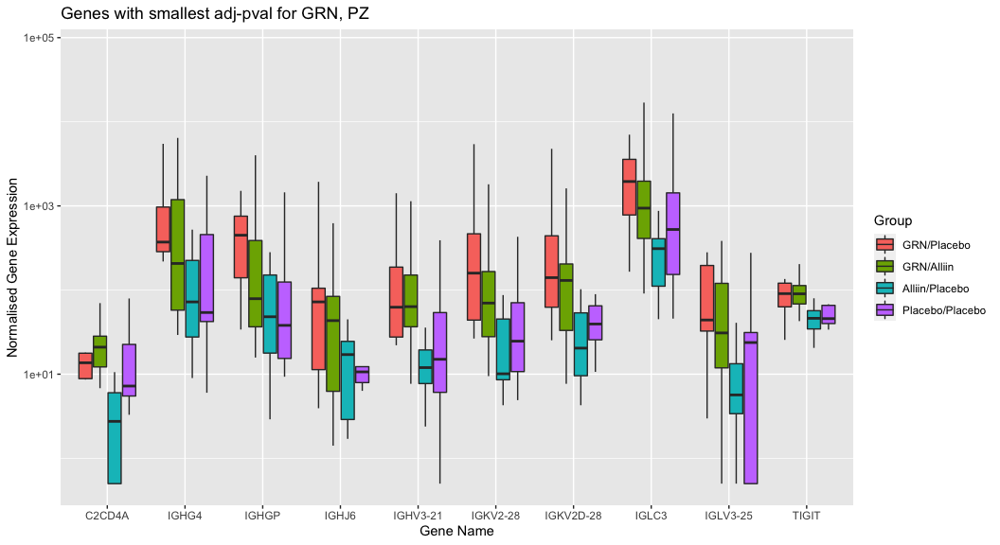<!-- -->

#### Differential genes for GRN in TZ

The following are the 10 genes with the smallest FDR-adjusted p-value
for the effect of GRN on the Transitional Zone.

``` r
Z <- "GRN, TZ"
res <- res.BC.TZ
dds <- dds.TZ
gTitle <- "Genes with smallest adj-pval for GRN, TZ"


# The 10 genes with the smallest adjusted p-value
subset.top <- res[ order(res$padj, decreasing = FALSE), ][1:10,]
print(subset.top)
```

    ## log2 fold change (MLE): TreatA 1 vs 0 
    ## Wald test p-value: TreatA 1 vs 0 
    ## DataFrame with 10 rows and 12 columns
    ##                  baseMean log2FoldChange     lfcSE      stat      pvalue
    ##                 <numeric>      <numeric> <numeric> <numeric>   <numeric>
    ## ENSG00000170373  140.2568       3.600279  0.670613   5.36864 7.93347e-08
    ## ENSG00000272668  370.9451      -0.837345  0.179641  -4.66120 3.14370e-06
    ## ENSG00000126733  109.5107       2.273286  0.513607   4.42612 9.59444e-06
    ## ENSG00000120471   48.9665      -1.294027  0.289372  -4.47184 7.75478e-06
    ## ENSG00000183888  112.3626       2.701831  0.634344   4.25925 2.05114e-05
    ## ENSG00000224331   61.9625       0.515635  0.122801   4.19893 2.68175e-05
    ## ENSG00000233251   96.4767      -0.670295  0.167312  -4.00625 6.16900e-05
    ## ENSG00000164283  282.6007      -1.214416  0.305431  -3.97607 7.00634e-05
    ## ENSG00000287499  147.7677       2.294498  0.573973   3.99757 6.39961e-05
    ## ENSG00000183833  580.9923      -0.448287  0.110950  -4.04043 5.33540e-05
    ##                       padj       ensemblID hngc.symbol            description
    ##                  <numeric>     <character> <character>            <character>
    ## ENSG00000170373 0.00202875 ENSG00000170373        CST1 cystatin SN [Source:..
    ## ENSG00000272668 0.04019539 ENSG00000272668          NA novel transcript, an..
    ## ENSG00000126733 0.06133724 ENSG00000126733       DACH2 dachshund family tra..
    ## ENSG00000120471 0.06133724 ENSG00000120471    TP53AIP1 tumor protein p53 re..
    ## ENSG00000183888 0.10490376 ENSG00000183888       SRARP steroid receptor ass..
    ## ENSG00000224331 0.11429635 ENSG00000224331          NA pseudogene similar t..
    ## ENSG00000233251 0.17916615 ENSG00000233251          NA novel transcript, an..
    ## ENSG00000164283 0.17916615 ENSG00000164283        ESM1 endothelial cell spe..
    ## ENSG00000287499 0.17916615 ENSG00000287499          NA       novel transcript
    ## ENSG00000183833 0.17916615 ENSG00000183833      CFAP91 cilia and flagella a..
    ##                            entrez.desc        name              biotype
    ##                            <character> <character>          <character>
    ## ENSG00000170373            cystatin SN        CST1       protein_coding
    ## ENSG00000272668 uncharacterized LOC1..                           lncRNA
    ## ENSG00000126733 dachshund family tra..       DACH2       protein_coding
    ## ENSG00000120471 tumor protein p53 re..    TP53AIP1       protein_coding
    ## ENSG00000183888 steroid receptor ass..       SRARP       protein_coding
    ## ENSG00000224331                     NA             processed_pseudogene
    ## ENSG00000233251 uncharacterized LOC1..                           lncRNA
    ## ENSG00000164283 endothelial cell spe..        ESM1       protein_coding
    ## ENSG00000287499                     NA                           lncRNA
    ## ENSG00000183833 cilia and flagella a..      CFAP91       protein_coding

``` r
for (ti in c(1:10)){
  topGene <- subset.top$ensemblID[ti]
  if (subset.top$hngc.symbol[ti] == "NA"){
    topGeneName <- topGene
  }else{
    topGeneName <- subset.top$hngc.symbol[ti]
  }
  toppval <- subset.top$pvalue[ti]
  topqval <- subset.top$padj[ti]
  normCounts <- plotCounts(dds, gene = topGene, intgroup = c("Group"), returnData = TRUE)
  normCounts$Gene <- topGene
  normCounts$GeneName <- topGeneName
  normCounts$pval <- toppval
  normCounts$qval <- topqval
  normCounts$title <- paste0(topGeneName, ", pval=", format(toppval, digits=3), ", qval=", format(topqval, digits=3) )
  head(normCounts)
  if (ti==1){
    TopNormCounts <- normCounts
  }else{
    TopNormCounts <- rbind(TopNormCounts, normCounts)
  }
  
}

TopNormCounts$Group <- factor(TopNormCounts$Group, levels = c("GRN/Placebo", "GRN/Alliin", 
                                                              "Alliin/Placebo", "Placebo/Placebo"))
## The following plots all the genes into one figure
pfig <- ggplot(TopNormCounts, aes(x = GeneName, y = count, fill = Group)) +
  geom_boxplot(outlier.shape = NA) +
  scale_y_log10() +
  xlab("Gene Name") +
  ylab("Normalised Gene Expression") +
  theme(axis.text.x = element_text(angle = 45)) +
  ggtitle(gTitle)
pfig
```

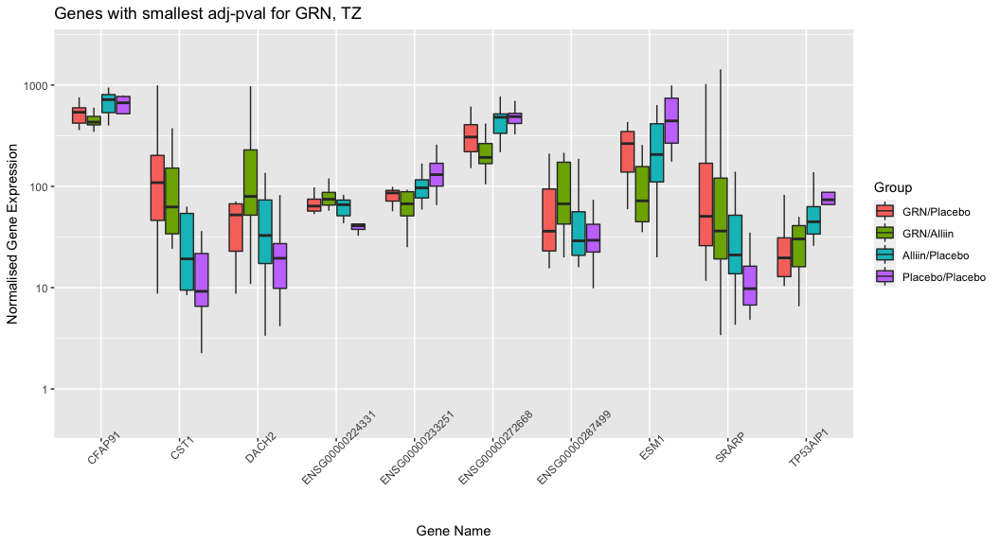<!-- -->

#### Differential genes for Alliin in PZ

The following are the 10 genes with the smallest FDR-adjusted p-value
for the effect of Alliin on the Peripheral Zone.

``` r
# For AC.PZ
Z <- "Alliin, PZ"
res <- res.AD.PZ
dds <- dds.PZ
gTitle <- "Genes with smallest adj-pval for Alliin, PZ"

print(paste0("Genes with smallest adj.p.values for ", Z))
```

    ## [1] "Genes with smallest adj.p.values for Alliin, PZ"

``` r
# The 10 genes with the smallest adjusted p-value
subset.top <- res[ order(res$padj, decreasing = FALSE), ][1:10,]
print(subset.top)
```

    ## log2 fold change (MLE): TreatB 1 vs 0 
    ## Wald test p-value: TreatB 1 vs 0 
    ## DataFrame with 10 rows and 12 columns
    ##                  baseMean log2FoldChange     lfcSE      stat      pvalue
    ##                 <numeric>      <numeric> <numeric> <numeric>   <numeric>
    ## ENSG00000102854   55.9299      -2.340107  0.464491  -5.03800 4.70411e-07
    ## ENSG00000211677 6177.3816      -2.776441  0.625818  -4.43650 9.14349e-06
    ## ENSG00000211676  347.8023      -2.831119  0.659508  -4.29277 1.76456e-05
    ## ENSG00000114854   79.8043      -1.263022  0.316328  -3.99276 6.53081e-05
    ## ENSG00000127249   37.7074       1.400948  0.392235   3.57171 3.54662e-04
    ## ENSG00000196796   23.6029       0.956229  0.261048   3.66304 2.49239e-04
    ## ENSG00000196436  154.6607       1.522370  0.423988   3.59060 3.29923e-04
    ## ENSG00000100626  304.3478       0.460905  0.130034   3.54449 3.93370e-04
    ## ENSG00000264230  204.2042      -1.061663  0.297155  -3.57276 3.53243e-04
    ## ENSG00000259976   28.4928      -1.459441  0.383414  -3.80643 1.40985e-04
    ##                      padj       ensemblID hngc.symbol            description
    ##                 <numeric>     <character> <character>            <character>
    ## ENSG00000102854 0.0118243 ENSG00000102854        MSLN mesothelin [Source:H..
    ## ENSG00000211677 0.1149154 ENSG00000211677       IGLC2 immunoglobulin lambd..
    ## ENSG00000211676 0.1478467 ENSG00000211676       IGLJ2 immunoglobulin lambd..
    ## ENSG00000114854 0.4103961 ENSG00000114854       TNNC1 troponin C1, slow sk..
    ## ENSG00000127249 0.7070586 ENSG00000127249     ATP13A4 ATPase 13A4 [Source:..
    ## ENSG00000196796 0.7070586 ENSG00000196796    NPIPB10P nuclear pore complex..
    ## ENSG00000196436 0.7070586 ENSG00000196436     NPIPB15 nuclear pore complex..
    ## ENSG00000100626 0.7070586 ENSG00000100626     GALNT16 polypeptide N-acetyl..
    ## ENSG00000264230 0.7070586 ENSG00000264230     ANXA8L1 annexin A8 like 1 [S..
    ## ENSG00000259976 0.7070586 ENSG00000259976          NA       novel transcript
    ##                            entrez.desc        name                biotype
    ##                            <character> <character>            <character>
    ## ENSG00000102854             mesothelin        MSLN         protein_coding
    ## ENSG00000211677                     NA       IGLC2              IG_C_gene
    ## ENSG00000211676                     NA       IGLJ2              IG_J_gene
    ## ENSG00000114854 troponin C1, slow sk..       TNNC1         protein_coding
    ## ENSG00000127249            ATPase 13A4     ATP13A4         protein_coding
    ## ENSG00000196796                     NA    NPIPB10P unprocessed_pseudogene
    ## ENSG00000196436 nuclear pore complex..     NPIPB15         protein_coding
    ## ENSG00000100626 polypeptide N-acetyl..     GALNT16         protein_coding
    ## ENSG00000264230      annexin A8 like 1     ANXA8L1         protein_coding
    ## ENSG00000259976                     NA                             lncRNA

``` r
for (ti in c(1:10)){
  topGene <- rownames(subset.top)[ti]
  if (subset.top$hngc.symbol[ti] == "NA"){
    topGeneName <- topGene
  }else{
    topGeneName <- subset.top$hngc.symbol[ti]
  }
  toppval <- subset.top$pvalue[ti]
  topqval <- subset.top$padj[ti]
  normCounts <- plotCounts(dds, gene = topGene, intgroup = c("Group"), returnData = TRUE)
  normCounts$Gene <- topGene
  normCounts$GeneName <- topGeneName
  normCounts$pval <- toppval
  normCounts$qval <- topqval
  normCounts$title <- paste0(topGeneName, ", pval=", format(toppval, digits=3), ", qval=", format(topqval, digits=3) )
  head(normCounts)
  if (ti==1){
    TopNormCounts <- normCounts
  }else{
    TopNormCounts <- rbind(TopNormCounts, normCounts)
  }
  
}

TopNormCounts$Group <- factor(TopNormCounts$Group, levels = c("Alliin/Placebo", "GRN/Alliin", 
                                                              "GRN/Placebo", "Placebo/Placebo"))
## Figure to include all the genes into one figure with no faceting
pfig <- ggplot(TopNormCounts, aes(x = GeneName, y = count, fill = Group)) +
  geom_boxplot(outlier.shape = NA) +
  scale_y_log10() +
  xlab("Gene Name") +
  ylab("Normalised Gene Expression") +
  theme(axis.text.x = element_text(angle = 45)) +
  ggtitle(gTitle)
pfig
```

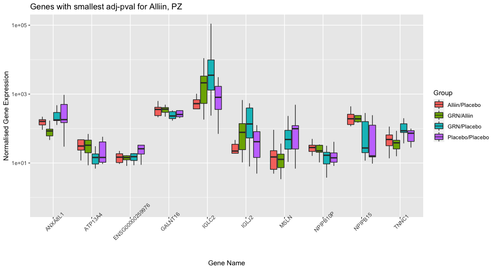<!-- -->

#### Differential genes for Alliin in TZ

The following are the 10 genes with the smallest FDR-adjusted p-value
for the effect of Alliin on the Transitional Zone.

``` r
Z <- "Alliin, TZ"
res <- res.AD.TZ
dds <- dds.TZ
gTitle <- "Genes with smallest adj-pval for Alliin, TZ"


# The 10 genes with smallest adjusted p-value
subset.top <- res[ order(res$padj, decreasing = FALSE), ][1:10,]
print(subset.top)
```

    ## log2 fold change (MLE): TreatB 1 vs 0 
    ## Wald test p-value: TreatB 1 vs 0 
    ## DataFrame with 10 rows and 12 columns
    ##                  baseMean log2FoldChange     lfcSE      stat      pvalue
    ##                 <numeric>      <numeric> <numeric> <numeric>   <numeric>
    ## ENSG00000109063  737.2489       1.716792 0.3397369   5.05330 4.34248e-07
    ## ENSG00000187122   78.2427       1.242024 0.2400688   5.17362 2.29606e-07
    ## ENSG00000120729  192.1394       1.694195 0.3410150   4.96809 6.76139e-07
    ## ENSG00000114854  449.1109       2.703126 0.5528743   4.88922 1.01235e-06
    ## ENSG00000173991  321.3915       2.839561 0.5775582   4.91649 8.81082e-07
    ## ENSG00000184226 6420.2505      -0.466315 0.0965094  -4.83181 1.35296e-06
    ## ENSG00000159173  356.4263       2.269734 0.4790989   4.73751 2.16364e-06
    ## ENSG00000239474  471.3760       1.951802 0.4151040   4.70196 2.57677e-06
    ## ENSG00000172399   81.5362       1.903104 0.4068996   4.67708 2.90982e-06
    ## ENSG00000235749   34.7242       1.756543 0.3818630   4.59993 4.22634e-06
    ##                       padj       ensemblID hngc.symbol            description
    ##                  <numeric>     <character> <character>            <character>
    ## ENSG00000109063 0.00437255 ENSG00000109063        MYH3 myosin heavy chain 3..
    ## ENSG00000187122 0.00437255 ENSG00000187122       SLIT1 slit guidance ligand..
    ## ENSG00000120729 0.00437255 ENSG00000120729        MYOT myotilin [Source:HGN..
    ## ENSG00000114854 0.00437255 ENSG00000114854       TNNC1 troponin C1, slow sk..
    ## ENSG00000173991 0.00437255 ENSG00000173991        TCAP titin-cap [Source:HG..
    ## ENSG00000184226 0.00486976 ENSG00000184226       PCDH9 protocadherin 9 [Sou..
    ## ENSG00000159173 0.00667514 ENSG00000159173       TNNI1 troponin I1, slow sk..
    ## ENSG00000239474 0.00695600 ENSG00000239474      KLHL41 kelch like family me..
    ## ENSG00000172399 0.00698227 ENSG00000172399       MYOZ2 myozenin 2 [Source:H..
    ## ENSG00000235749 0.00912720 ENSG00000235749          NA novel transcript, an..
    ##                            entrez.desc        name        biotype
    ##                            <character> <character>    <character>
    ## ENSG00000109063   myosin heavy chain 3        MYH3 protein_coding
    ## ENSG00000187122 slit guidance ligand 1       SLIT1 protein_coding
    ## ENSG00000120729               myotilin        MYOT protein_coding
    ## ENSG00000114854 troponin C1, slow sk..       TNNC1 protein_coding
    ## ENSG00000173991              titin-cap        TCAP protein_coding
    ## ENSG00000184226        protocadherin 9       PCDH9 protein_coding
    ## ENSG00000159173 troponin I1, slow sk..       TNNI1 protein_coding
    ## ENSG00000239474 kelch like family me..      KLHL41 protein_coding
    ## ENSG00000172399             myozenin 2       MYOZ2 protein_coding
    ## ENSG00000235749                     NA                     lncRNA

``` r
for (ti in c(1:10)){
  topGene <- subset.top$ensemblID[ti]
  if (subset.top$hngc.symbol[ti] == "NA"){
    topGeneName <- topGene
  }else{
    topGeneName <- subset.top$hngc.symbol[ti]
  }
  toppval <- subset.top$pvalue[ti]
  topqval <- subset.top$padj[ti]
  normCounts <- plotCounts(dds, gene = topGene, intgroup = c("Group"), returnData = TRUE)
  normCounts$Gene <- topGene
  normCounts$GeneName <- topGeneName
  normCounts$pval <- toppval
  normCounts$qval <- topqval
  normCounts$title <- paste0(topGeneName, ", pval=", format(toppval, digits=3), ", qval=", format(topqval, digits=3) )
  head(normCounts)
  if (ti==1){
    TopNormCounts <- normCounts
  }else{
    TopNormCounts <- rbind(TopNormCounts, normCounts)
  }
  
}

TopNormCounts$Group <- factor(TopNormCounts$Group, levels = c("Alliin/Placebo", "GRN/Alliin", 
                                                              "GRN/Placebo", "Placebo/Placebo"))
## The following plots all the genes into one figure
pfig <- ggplot(TopNormCounts, aes(x = GeneName, y = count, fill = Group)) +
  geom_boxplot(outlier.shape = NA) +
  scale_y_log10() +
  xlab("Gene Name") +
  ylab("Normalised Gene Expression") +
  ggtitle(gTitle)
pfig
```

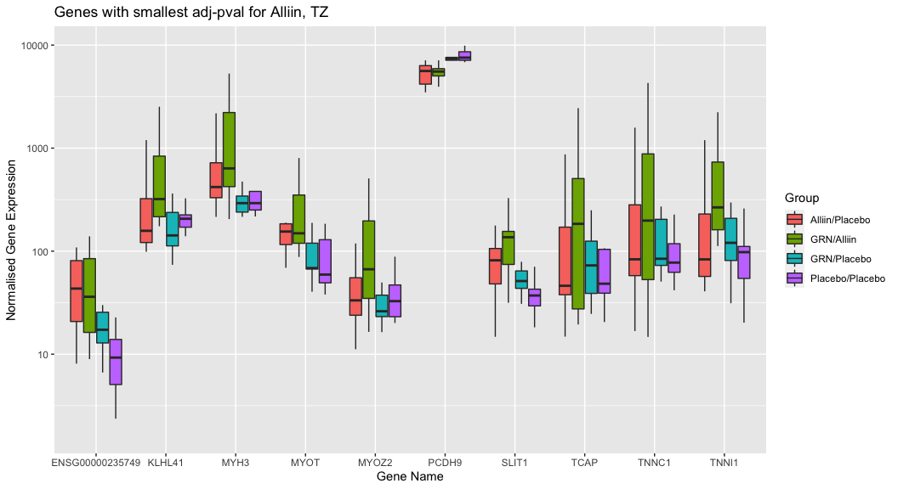<!-- -->

### Volcano Plot

The following figures show the Volcano Plots for the tests on the effect
of GRN and Alliin in each of the prostate zones.

``` r
p.adj.th <- 0.05
fc.th <- 1

# "BC.PZ" 
tr <- "GRN"
zone <- "PZ"
res <- res.BC.PZ
tr.name <- "glucoraphanin"

print(paste0("Processing: ", tr, ", zone: ", zone))
```

    ## [1] "Processing: GRN, zone: PZ"

``` r
v.title <- "Volcano Plot"
v.subtitle <- paste0(zone, ", " ,tr.name, ", p.val<= ", p.adj.th)


## Volcano Plot ##
# remove genes with NA pvalues
keep <- !is.na(res$pvalue)
resultsObject <- res[keep,]


# Enhanced Volcano Plot
EnhancedVolcano(resultsObject,
                lab = resultsObject$hngc.symbol,
                x = 'log2FoldChange',
                y = 'pvalue',
                pCutoff = p.adj.th,
                FCcutoff = fc.th,
                title = v.title,
                subtitle = v.subtitle)
```

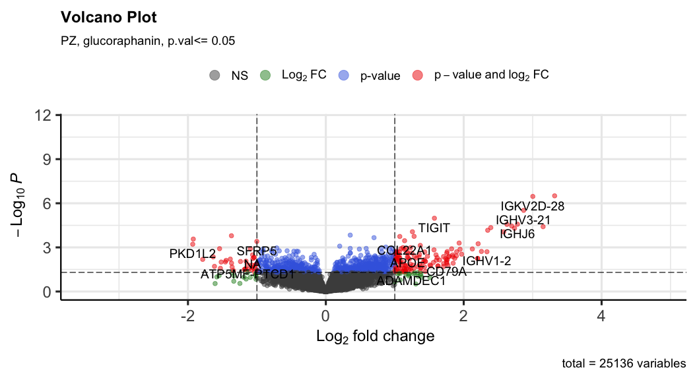<!-- -->

``` r
# "AD.PZ"
tr <- "Alliin"
zone <- "PZ"
res <- res.AD.PZ
tr.name <- "alliin"

print(paste0("Processing: ", tr, ", zone: ", zone))
```

    ## [1] "Processing: Alliin, zone: PZ"

``` r
v.title <- "Volcano Plot"
v.subtitle <- paste0(zone, ", " ,tr.name, ", p.val<= ", p.adj.th)


## Volcano Plot ##
# remove genes with NA pvalues
keep <- !is.na(res$pvalue)
resultsObject <- res[keep,]

# Enhanced Volcano Plot
EnhancedVolcano(resultsObject,
                lab = as.character(resultsObject$hngc.symbol),
                x = 'log2FoldChange',
                y = 'pvalue',
                pCutoff = p.adj.th,
                FCcutoff = fc.th,
                title = v.title,
                subtitle = v.subtitle)
```

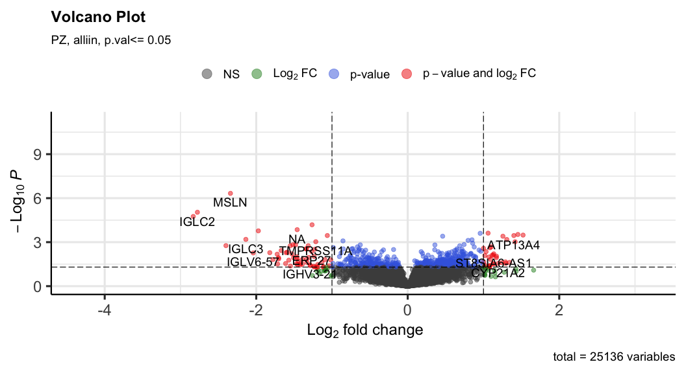<!-- -->

``` r
# "BC.TZ"
tr <- "GRN"
zone <- "TZ"
res <- res.BC.TZ
tr.name <- "glucoraphanin"

print(paste0("Processing: ", tr, ", zone: ", zone))
```

    ## [1] "Processing: GRN, zone: TZ"

``` r
v.title <- "Volcano Plot"
v.subtitle <- paste0(zone, ", " ,tr.name, ", p.val<= ", p.adj.th)


## Volcano Plot ##
# remove genes with NA pvalues
keep <- !is.na(res$pvalue)
resultsObject <- res[keep,]

# Enhanced Volcano Plot
EnhancedVolcano(resultsObject,
                lab = as.character(resultsObject$hngc.symbol),
                x = 'log2FoldChange',
                y = 'pvalue',
                pCutoff = p.adj.th,
                FCcutoff = fc.th,
                title = v.title,
                subtitle = v.subtitle)
```

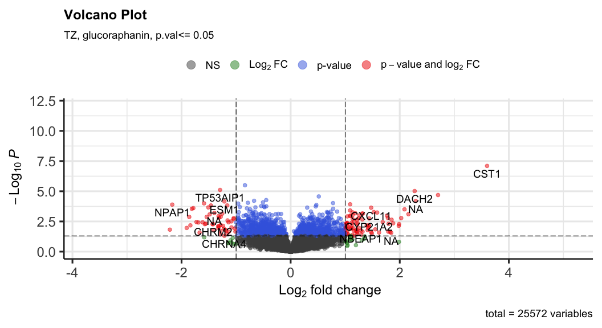<!-- -->

``` r
# "AD.TZ"
tr <- "Alliin"
zone <- "TZ"
res <- res.AD.TZ
tr.name <- "alliin"

print(paste0("Processing: ", tr, ", zone: ", zone))
```

    ## [1] "Processing: Alliin, zone: TZ"

``` r
v.title <- "Volcano Plot"
v.subtitle <- paste0(zone, ", " ,tr.name, ", p.val<= ", p.adj.th)


## Volcano Plot ##
# remove genes with NA pvalues
keep <- !is.na(res$pvalue)
resultsObject <- res[keep,]

# Enhanced Volcano Plot
EnhancedVolcano(resultsObject,
                lab = as.character(resultsObject$hngc.symbol),
                x = 'log2FoldChange',
                y = 'pvalue',
                pCutoff = p.adj.th,
                FCcutoff = fc.th,
                title = v.title,
                subtitle = v.subtitle)
```

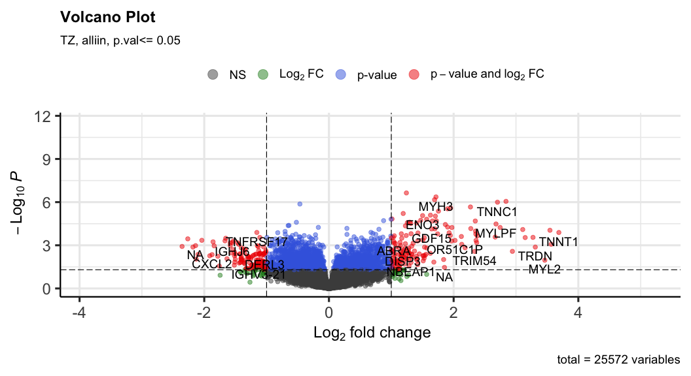<!-- -->

### Venn Diagrams

``` r
# Plot Venn Diagrams 

## 1. Common genes between GRN and Alliin, PZ, adjusted p-value < 0.5
venn_data <- data.frame( GRN.PZ.0.5 = res.BC.PZ$padj < 0.5,
                         Alliin.PZ.0.5 = res.AD.PZ$padj < 0.5)
vennDiagram(venn_data)
```

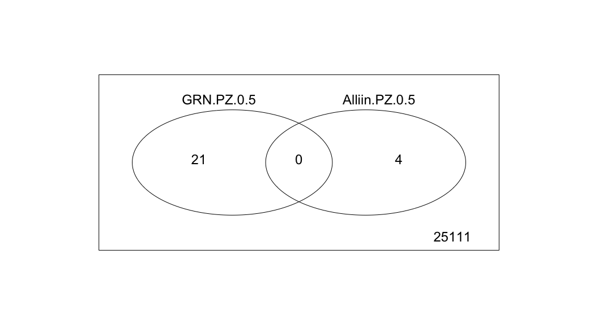<!-- -->

``` r
n <- length(which(venn_data$GRN.PZ.0.5 == TRUE & venn_data$Alliin.PZ.0.5 == TRUE))
print(paste0("Common genes between GRN and Alliin, PZ, p.val < 0.5 : ", n))
```

    ## [1] "Common genes between GRN and Alliin, PZ, p.val < 0.5 : 0"

``` r
## 2. Common genes between GRN and Allinn, TZ, adjusted p-value < 0.5
venn_data <- data.frame( GRN.TZ.0.5 = res.BC.TZ$padj < 0.5,
                         Alliin.TZ.0.5 = res.AD.TZ$padj < 0.5 )
vennDiagram(venn_data)
```

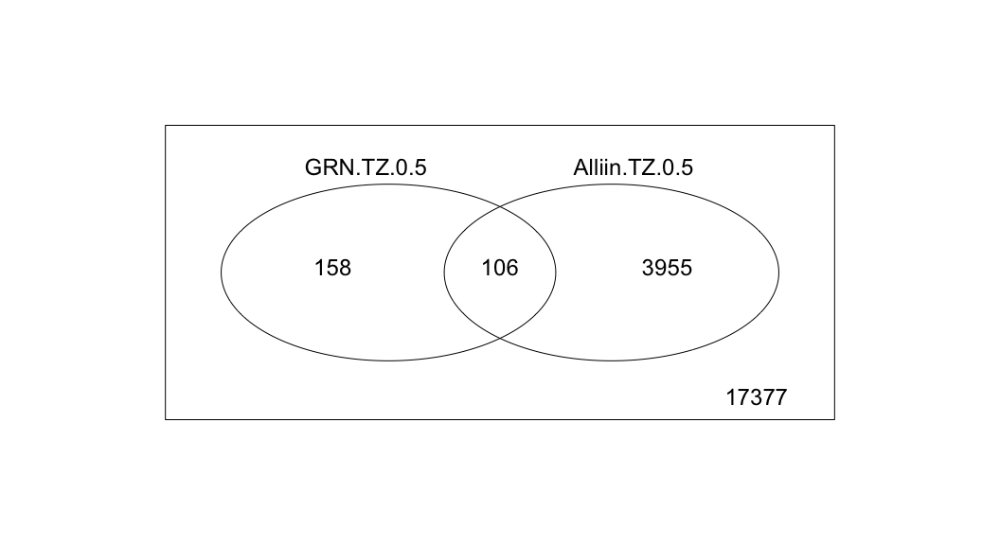<!-- -->

``` r
n <- length(which(venn_data$GRN.TZ.0.5 == TRUE & venn_data$Alliin.TZ.0.5 == TRUE))
print(paste0("Common genes between GRN and Alliin, TZ, p.val < 0.5 : ", n))
```

    ## [1] "Common genes between GRN and Alliin, TZ, p.val < 0.5 : 106"

``` r
## Save Common genes between GRN and Allinn, TZ, adjusted p-value < 0.5 to file
g <- res.BC.TZ[!is.na(res.BC.TZ$padj),]
indx <- g$padj < 0.5
GRN.df <- as.data.frame(g[indx,])

g <- res.AD.TZ[!is.na(res.AD.TZ$padj),]
indx <- g$padj < 0.5
Alliin.df <- as.data.frame(g[indx,])

CommonGenes <- inner_join(GRN.df, Alliin.df, by = c("ensemblID", "hngc.symbol", "baseMean", 
                                                    "description", "entrez.desc", "name", "biotype"),
                          suffix = c(".GRN", ".Alliin"))
# Arrange column names
CommonGenes <- CommonGenes[,c(7, 8, 1, 2, 13, 3, 14, 4, 15, 5, 16, 6, 17, 9:12)]
# Order table by GRN adjusted p-value
ComonGenesOrdered <- CommonGenes[order(CommonGenes$padj.GRN), ]
# Show some of the common genes
head(ComonGenesOrdered)
```

    ##          ensemblID hngc.symbol  baseMean log2FoldChange.GRN
    ## 34 ENSG00000272668          NA 370.94515         -0.8373445
    ## 64 ENSG00000224331          NA  61.96246          0.5156352
    ## 69 ENSG00000233251          NA  96.47671         -0.6702945
    ## 84 ENSG00000164283        ESM1 282.60069         -1.2144161
    ## 43 ENSG00000154928       EPHB1 197.28302         -0.9619865
    ## 80 ENSG00000137872      SEMA6D 787.32269         -0.5072452
    ##    log2FoldChange.Alliin lfcSE.GRN lfcSE.Alliin  stat.GRN stat.Alliin
    ## 34            -0.3874552 0.1796414    0.1796509 -4.661200   -2.156712
    ## 64             0.4371106 0.1228015    0.1227079  4.198933    3.562204
    ## 69            -0.4012069 0.1673122    0.1673212 -4.006251   -2.397825
    ## 84            -1.1083812 0.3054312    0.3054319 -3.976070   -3.628897
    ## 43            -0.4970687 0.2480615    0.2480748 -3.878016   -2.003705
    ## 80            -0.3740453 0.1288174    0.1288185 -3.937707   -2.903662
    ##      pvalue.GRN pvalue.Alliin   padj.GRN padj.Alliin
    ## 34 3.143703e-06  0.0310281402 0.04019539  0.35218810
    ## 64 2.681754e-05  0.0003677540 0.11429635  0.08354297
    ## 69 6.169003e-05  0.0164927296 0.17916615  0.29157624
    ## 84 7.006341e-05  0.0002846342 0.17916615  0.07892101
    ## 43 1.053118e-04  0.0451016563 0.17953559  0.39423933
    ## 80 8.226407e-05  0.0036882566 0.17953559  0.17980043
    ##                                                                description
    ## 34                                    novel transcript, antisense to VSIG8
    ## 64             pseudogene similar to part of ribosomal protein L10 (RPL10)
    ## 69                                  novel transcript, antisense to CCDC85A
    ## 84 endothelial cell specific molecule 1 [Source:HGNC Symbol;Acc:HGNC:3466]
    ## 43                      EPH receptor B1 [Source:HGNC Symbol;Acc:HGNC:3392]
    ## 80                       semaphorin 6D [Source:HGNC Symbol;Acc:HGNC:16770]
    ##                             entrez.desc   name              biotype
    ## 34         uncharacterized LOC107985216                      lncRNA
    ## 64                                   NA        processed_pseudogene
    ## 69         uncharacterized LOC100129434                      lncRNA
    ## 84 endothelial cell specific molecule 1   ESM1       protein_coding
    ## 43                      EPH receptor B1  EPHB1       protein_coding
    ## 80                        semaphorin 6D SEMA6D       protein_coding

``` r
if(saveFiles){
  write.table(CommonGenes, paste0(DELOC, "common-genes-TZ.0.5.txt"), quote = FALSE, sep = "\t")
}


## 3. Common genes between GRN and Allinn, TZ, p.val < 0.1
venn_data <- data.frame( GRN.TZ.0.1 = res.BC.TZ$padj < 0.1,
                         Alliin.TZ.0.1 = res.AD.TZ$padj < 0.1 )
vennDiagram(venn_data)
```

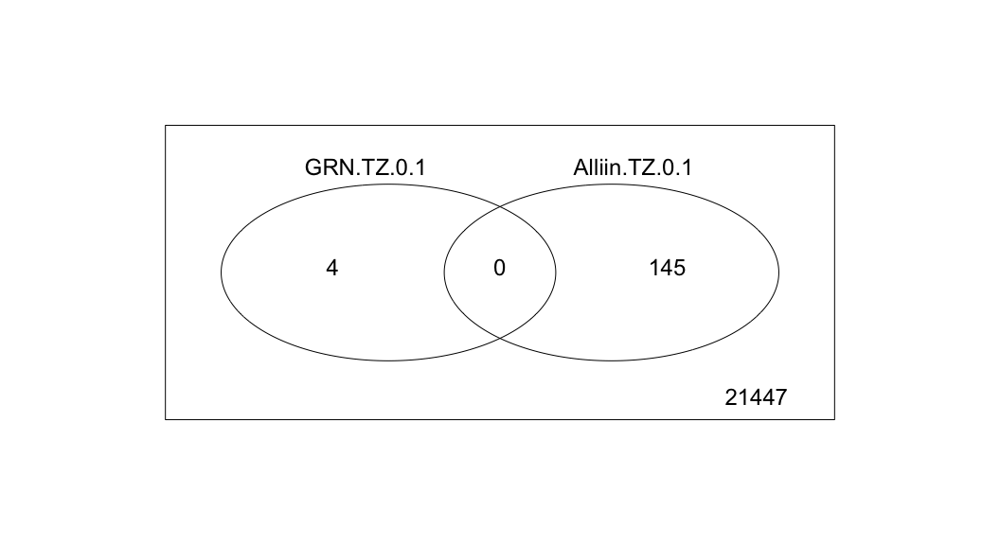<!-- -->

``` r
n <- length(which(venn_data$GRN.TZ.0.1 == TRUE & venn_data$Alliin.TZ.0.1 == TRUE))
print(paste0("Common genes between GRN and Alliin, TZ, p.val < 0.1 : ", n))
```

    ## [1] "Common genes between GRN and Alliin, TZ, p.val < 0.1 : 0"

``` r
sessionInfo()
```

    ## R version 4.0.3 (2020-10-10)
    ## Platform: x86_64-apple-darwin17.0 (64-bit)
    ## Running under: macOS Big Sur 10.16
    ## 
    ## Matrix products: default
    ## BLAS:   /Library/Frameworks/R.framework/Versions/4.0/Resources/lib/libRblas.dylib
    ## LAPACK: /Library/Frameworks/R.framework/Versions/4.0/Resources/lib/libRlapack.dylib
    ## 
    ## locale:
    ## [1] en_GB.UTF-8/en_GB.UTF-8/en_GB.UTF-8/C/en_GB.UTF-8/en_GB.UTF-8
    ## 
    ## attached base packages:
    ## [1] parallel  stats4    stats     graphics  grDevices utils     datasets 
    ## [8] methods   base     
    ## 
    ## other attached packages:
    ##  [1] stringr_1.4.0               pheatmap_1.0.12            
    ##  [3] dplyr_1.0.7                 plotly_4.9.4.1             
    ##  [5] knitr_1.33                  ggpubr_0.4.0               
    ##  [7] ashr_2.2-47                 ggbeeswarm_0.6.0           
    ##  [9] PoiClaClu_1.0.2.1           glmpca_0.2.0               
    ## [11] magrittr_2.0.1              readxl_1.3.1               
    ## [13] gplots_3.1.1                RColorBrewer_1.1-2         
    ## [15] org.Hs.eg.db_3.12.0         apeglm_1.12.0              
    ## [17] EnhancedVolcano_1.8.0       ggrepel_0.9.1              
    ## [19] ggplot2_3.3.5               geneplotter_1.68.0         
    ## [21] annotate_1.68.0             XML_3.99-0.7               
    ## [23] AnnotationDbi_1.52.0        lattice_0.20-44            
    ## [25] DESeq2_1.30.1               SummarizedExperiment_1.20.0
    ## [27] Biobase_2.50.0              MatrixGenerics_1.2.1       
    ## [29] matrixStats_0.60.1          GenomicRanges_1.42.0       
    ## [31] GenomeInfoDb_1.26.7         IRanges_2.24.1             
    ## [33] S4Vectors_0.28.1            BiocGenerics_0.36.1        
    ## [35] biomaRt_2.46.3              edgeR_3.32.1               
    ## [37] limma_3.46.0               
    ## 
    ## loaded via a namespace (and not attached):
    ##   [1] backports_1.2.1        systemfonts_1.0.2      BiocFileCache_1.14.0  
    ##   [4] plyr_1.8.6             lazyeval_0.2.2         splines_4.0.3         
    ##   [7] BiocParallel_1.24.1    digest_0.6.27          invgamma_1.1          
    ##  [10] htmltools_0.5.2        SQUAREM_2021.1         fansi_0.5.0           
    ##  [13] memoise_2.0.0          openxlsx_4.2.4         extrafont_0.17        
    ##  [16] extrafontdb_1.0        askpass_1.1            bdsmatrix_1.3-4       
    ##  [19] prettyunits_1.1.1      colorspace_2.0-2       blob_1.2.2            
    ##  [22] rappdirs_0.3.3         textshaping_0.3.5      haven_2.4.3           
    ##  [25] xfun_0.25              jsonlite_1.7.2         crayon_1.4.1          
    ##  [28] RCurl_1.98-1.4         genefilter_1.72.1      survival_3.2-13       
    ##  [31] glue_1.4.2             gtable_0.3.0           zlibbioc_1.36.0       
    ##  [34] XVector_0.30.0         DelayedArray_0.16.3    proj4_1.0-10.1        
    ##  [37] car_3.0-11             Rttf2pt1_1.3.9         maps_3.3.0            
    ##  [40] abind_1.4-5            scales_1.1.1           mvtnorm_1.1-2         
    ##  [43] DBI_1.1.1              rstatix_0.7.0          Rcpp_1.0.7            
    ##  [46] viridisLite_0.4.0      xtable_1.8-4           progress_1.2.2        
    ##  [49] emdbook_1.3.12         foreign_0.8-81         bit_4.0.4             
    ##  [52] truncnorm_1.0-8        htmlwidgets_1.5.3      httr_1.4.2            
    ##  [55] ellipsis_0.3.2         farver_2.1.0           pkgconfig_2.0.3       
    ##  [58] dbplyr_2.1.1           locfit_1.5-9.4         utf8_1.2.2            
    ##  [61] labeling_0.4.2         tidyselect_1.1.1       rlang_0.4.11          
    ##  [64] munsell_0.5.0          cellranger_1.1.0       tools_4.0.3           
    ##  [67] cachem_1.0.6           cli_3.0.1              generics_0.1.0        
    ##  [70] RSQLite_2.2.8          broom_0.7.9            evaluate_0.14         
    ##  [73] fastmap_1.1.0          ragg_1.1.3             yaml_2.2.1            
    ##  [76] bit64_4.0.5            zip_2.2.0              caTools_1.18.2        
    ##  [79] purrr_0.3.4            ash_1.0-15             ggrastr_0.2.3         
    ##  [82] xml2_1.3.2             rstudioapi_0.13        compiler_4.0.3        
    ##  [85] beeswarm_0.4.0         curl_4.3.2             ggsignif_0.6.2        
    ##  [88] tibble_3.1.4           stringi_1.7.4          highr_0.9             
    ##  [91] ggalt_0.4.0            forcats_0.5.1          Matrix_1.3-4          
    ##  [94] vctrs_0.3.8            pillar_1.6.2           lifecycle_1.0.0       
    ##  [97] BiocManager_1.30.16    data.table_1.14.0      bitops_1.0-7          
    ## [100] irlba_2.3.3            R6_2.5.1               KernSmooth_2.23-20    
    ## [103] rio_0.5.27             vipor_0.4.5            MASS_7.3-54           
    ## [106] gtools_3.9.2           assertthat_0.2.1       openssl_1.4.4         
    ## [109] withr_2.4.2            GenomeInfoDbData_1.2.4 hms_1.1.0             
    ## [112] grid_4.0.3             tidyr_1.1.3            coda_0.19-4           
    ## [115] rmarkdown_2.10         carData_3.0-4          mixsqp_0.3-43         
    ## [118] bbmle_1.0.24           numDeriv_2016.8-1.1
